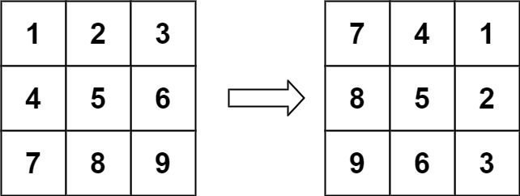
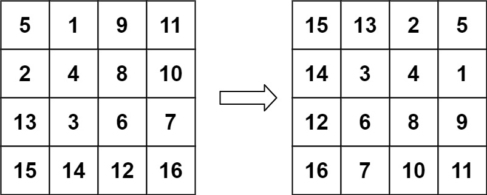

## Algorithm

[48. Rotate Image](https://leetcode.com/problems/rotate-image/)

### Description

You are given an n x n 2D matrix representing an image, rotate the image by 90 degrees (clockwise).

You have to rotate the image in-place, which means you have to modify the input 2D matrix directly. DO NOT allocate another 2D matrix and do the rotation.

Example 1:



```
Input: matrix = [[1,2,3],[4,5,6],[7,8,9]]
Output: [[7,4,1],[8,5,2],[9,6,3]]
```

Example 2:



```
Input: matrix = [[5,1,9,11],[2,4,8,10],[13,3,6,7],[15,14,12,16]]
Output: [[15,13,2,5],[14,3,4,1],[12,6,8,9],[16,7,10,11]]
```

Example 3:

```
Input: matrix = [[1]]
Output: [[1]]
```

Example 4:

```
Input: matrix = [[1,2],[3,4]]
Output: [[3,1],[4,2]]
```

Constraints:

- matrix.length == n
- matrix[i].length == n
- 1 <= n <= 20
- -1000 <= matrix[i][j] <= 1000


### Solution

```java
class Solution {
    public void rotate(int[][] matrix) {
        int n = matrix.length;
        for(int i=0;i<(n/2);i++){
            for(int j=i;j<(n-1-i);j++){
                int temp = matrix[i][j];
                matrix[i][j] = matrix[n-1-j][i];
                matrix[n-1-j][i] = matrix[n-1-i][n-1-j];
                matrix[n-1-i][n-1-j] = matrix[j][n-1-i];
                matrix[j][n-1-i] = temp;
            }
        }
    }
}
```

### Discuss

## Review


## Tip


## Share
