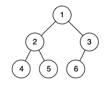
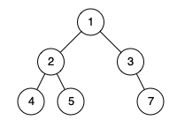

## Algorithm

[958. Check Completeness of a Binary Tree](https://leetcode.com/problems/check-completeness-of-a-binary-tree/)

### Description

Given the root of a binary tree, determine if it is a complete binary tree.

In a complete binary tree, every level, except possibly the last, is completely filled, and all nodes in the last level are as far left as possible. It can have between 1 and 2h nodes inclusive at the last level h.

Example 1:



```
Input: root = [1,2,3,4,5,6]
Output: true
Explanation: Every level before the last is full (ie. levels with node-values {1} and {2, 3}), and all nodes in the last level ({4, 5, 6}) are as far left as possible.
```

Example 2:



```
Input: root = [1,2,3,4,5,null,7]
Output: false
Explanation: The node with value 7 isn't as far left as possible.
```

Constraints:

- The number of nodes in the tree is in the range [1, 100].
- 1 <= Node.val <= 1000

### Solution

```java
/**
 * Definition for a binary tree node.
 * public class TreeNode {
 *     int val;
 *     TreeNode left;
 *     TreeNode right;
 *     TreeNode() {}
 *     TreeNode(int val) { this.val = val; }
 *     TreeNode(int val, TreeNode left, TreeNode right) {
 *         this.val = val;
 *         this.left = left;
 *         this.right = right;
 *     }
 * }
 */
class Solution {
    public boolean isCompleteTree(TreeNode root) {
        Queue<TreeNode> bfs = new LinkedList<TreeNode>();
        bfs.offer(root);
        while(bfs.peek()!=null){
            TreeNode node = bfs.poll();
            bfs.offer(node.left);
            bfs.offer(node.right);
        }
        while (!bfs.isEmpty() && bfs.peek() == null){
            bfs.poll();
        }
        return bfs.isEmpty();
    }
}
```

### Discuss

## Review


## Tip


## Share
