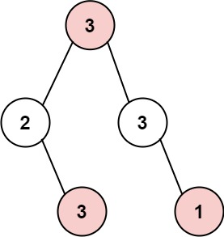

## Algorithm

[337. House Robber III](https://leetcode.com/problems/house-robber-iii/)

### Description

The thief has found himself a new place for his thievery again. There is only one entrance to this area, called root.

Besides the root, each house has one and only one parent house. After a tour, the smart thief realized that all houses in this place form a binary tree. It will automatically contact the police if two directly-linked houses were broken into on the same night.

Given the root of the binary tree, return the maximum amount of money the thief can rob without alerting the police.


Example 1:



```
Input: root = [3,2,3,null,3,null,1]
Output: 7
Explanation: Maximum amount of money the thief can rob = 3 + 3 + 1 = 7.
```

Example 2:


```
Input: root = [3,4,5,1,3,null,1]
Output: 9
Explanation: Maximum amount of money the thief can rob = 4 + 5 = 9.
```

Constraints:

- The number of nodes in the tree is in the range [1, 104].
- 0 <= Node.val <= 104

### Solution

```java
/**
 * Definition for a binary tree node.
 * public class TreeNode {
 *     int val;
 *     TreeNode left;
 *     TreeNode right;
 *     TreeNode() {}
 *     TreeNode(int val) { this.val = val; }
 *     TreeNode(int val, TreeNode left, TreeNode right) {
 *         this.val = val;
 *         this.left = left;
 *         this.right = right;
 *     }
 * }
 */
class Solution {
    public int rob(TreeNode root) {
        if(root == null) return 0;

        int[] sums = robSubSum(root);
        return Math.max(sums[0], sums[1]);
    }

    private int[] robSubSum(TreeNode root) {
        if(root == null) return new int[]{0,0};

        int[] leftSum = robSubSum(root.left);
        int[] rightSum = robSubSum(root.right);

        int[] sums = new int[2];
        // case of skip this node
        sums[0] = Math.max(leftSum[0],leftSum[1]) + Math.max(rightSum[0],rightSum[1]);  
        // case of count this node
        sums[1] = Math.max(sums[0], root.val + leftSum[0] + rightSum[0]);

        return sums;
    }
}
```

### Discuss

## Review


## Tip


## Share
