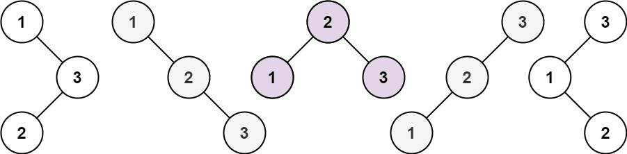

## Algorithm

[96. Unique Binary Search Trees](https://leetcode.com/problems/unique-binary-search-trees/)

### Description

Given an integer n, return the number of structurally unique BST's (binary search trees) which has exactly n nodes of unique values from 1 to n.


Example 1:



```
Input: n = 3
Output: 5
```

Example 2:

```
Input: n = 1
Output: 1
```

Constraints:

- 1 <= n <= 19

### Solution

```java
class Solution {
    public int numTrees(int n) {
        if(n==0||n==1){
            return 1;
        }
        int[] res = new int[n+1];
        res[0] = 1;
        for(int i=1;i<=n;i++){
            for(int j=0;j<i;j++){
                res[i]+=res[j]*res[i-j-1];
            }
        }
        return res[n];
    }
}
```

### Discuss

## Review


## Tip


## Share
