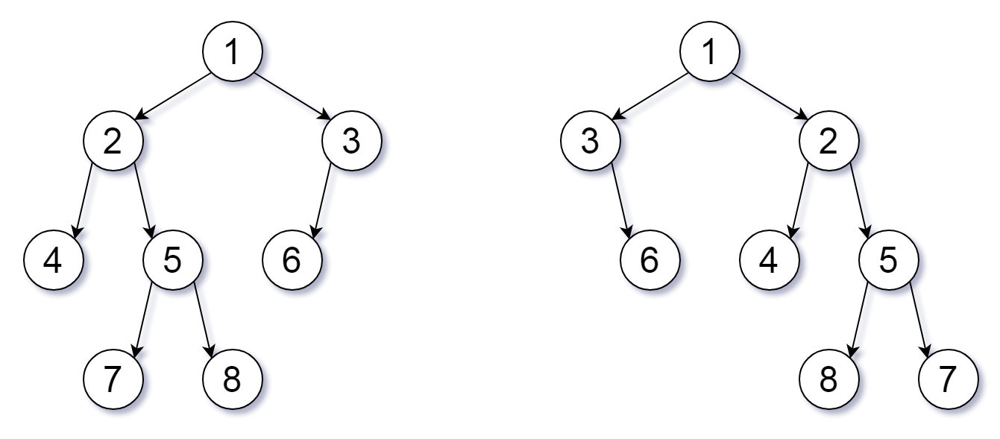

## Algorithm

[951. Flip Equivalent Binary Trees](https://leetcode.com/problems/flip-equivalent-binary-trees/)

### Description

For a binary tree T, we can define a flip operation as follows: choose any node, and swap the left and right child subtrees.

A binary tree X is flip equivalent to a binary tree Y if and only if we can make X equal to Y after some number of flip operations.

Given the roots of two binary trees root1 and root2, return true if the two trees are flip equivelent or false otherwise.

Example 1:



```
Flipped Trees Diagram
Input: root1 = [1,2,3,4,5,6,null,null,null,7,8], root2 = [1,3,2,null,6,4,5,null,null,null,null,8,7]
Output: true
Explanation: We flipped at nodes with values 1, 3, and 5.
```

Example 2:

```
Input: root1 = [], root2 = []
Output: true
```

Example 3:

```
Input: root1 = [], root2 = [1]
Output: false
```

Example 4:

```
Input: root1 = [0,null,1], root2 = []
Output: false
```

Example 5:

```
Input: root1 = [0,null,1], root2 = [0,1]
Output: true
```

Constraints:

- The number of nodes in each tree is in the range [0, 100].
- Each tree will have unique node values in the range [0, 99].

### Solution

```java
/**
 * Definition for a binary tree node.
 * public class TreeNode {
 *     int val;
 *     TreeNode left;
 *     TreeNode right;
 *     TreeNode() {}
 *     TreeNode(int val) { this.val = val; }
 *     TreeNode(int val, TreeNode left, TreeNode right) {
 *         this.val = val;
 *         this.left = left;
 *         this.right = right;
 *     }
 * }
 */
class Solution {
    public boolean flipEquiv(TreeNode root1, TreeNode root2) {
        if (root1 == null) {
            return root2 == null;
        }
        if (root2 == null) {
            return root1 == null;
        }
        if (root1.val != root2.val){
            return false;
        }
        return (flipEquiv(root1.left, root2.left) && flipEquiv(root1.right, root2.right)) || (
            flipEquiv(root1.left, root2.right) && flipEquiv(root1.right, root2.left)
        );
    }
}
```

### Discuss

## Review


## Tip


## Share
