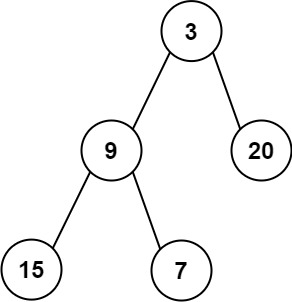

## Algorithm

[637. Average of Levels in Binary Tree](https://leetcode.com/problems/average-of-levels-in-binary-tree/)

### Description

Given the root of a binary tree, return the average value of the nodes on each level in the form of an array. Answers within 10-5 of the actual answer will be accepted.


Example 1:


```
Input: root = [3,9,20,null,null,15,7]
Output: [3.00000,14.50000,11.00000]
Explanation: The average value of nodes on level 0 is 3, on level 1 is 14.5, and on level 2 is 11.
Hence return [3, 14.5, 11].
```

Example 2:



```
Input: root = [3,9,20,15,7]
Output: [3.00000,14.50000,11.00000]
```

Constraints:

- The number of nodes in the tree is in the range [1, 104].
- -231 <= Node.val <= 231 - 1

### Solution

```java
/**
 * Definition for a binary tree node.
 * public class TreeNode {
 *     int val;
 *     TreeNode left;
 *     TreeNode right;
 *     TreeNode() {}
 *     TreeNode(int val) { this.val = val; }
 *     TreeNode(int val, TreeNode left, TreeNode right) {
 *         this.val = val;
 *         this.left = left;
 *         this.right = right;
 *     }
 * }
 */
class Solution {
    public List<Double> averageOfLevels(TreeNode root) {
        List<Double> result = new ArrayList<>();
        Queue<TreeNode> queue = new LinkedList<>();
        if(root==null){
            return result;
        }
        queue.add(root);
        while(!queue.isEmpty()){
            int size = queue.size();
            double sum = 0;
            for(int i=0;i<size;i++){
                TreeNode temp = queue.poll();
                sum+=temp.val;
                if(temp.left!=null){
                    queue.add(temp.left);
                }
                if(temp.right!=null){
                    queue.add(temp.right);
                }
            }
            result.add(sum/size);
        }
        return result;
    }
}
```

### Discuss

## Review


## Tip


## Share
