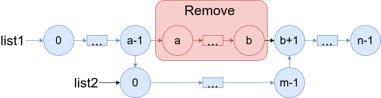
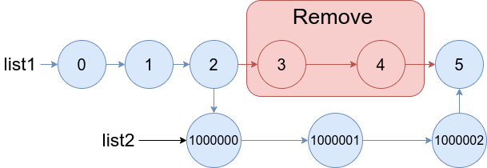
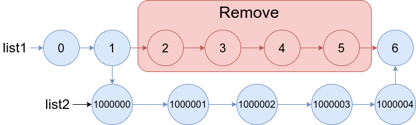

## Algorithm

[1669. Merge In Between Linked Lists](https://leetcode.com/problems/merge-in-between-linked-lists/)

### Description

You are given two linked lists: list1 and list2 of sizes n and m respectively.

Remove list1's nodes from the ath node to the bth node, and put list2 in their place.

The blue edges and nodes in the following figure incidate the result:



Build the result list and return its head.

Example 1:



```
Input: list1 = [0,1,2,3,4,5], a = 3, b = 4, list2 = [1000000,1000001,1000002]
Output: [0,1,2,1000000,1000001,1000002,5]
Explanation: We remove the nodes 3 and 4 and put the entire list2 in their place. The blue edges and nodes in the above figure indicate the result.
```

Example 2:



```
Input: list1 = [0,1,2,3,4,5,6], a = 2, b = 5, list2 = [1000000,1000001,1000002,1000003,1000004]
Output: [0,1,1000000,1000001,1000002,1000003,1000004,6]
Explanation: The blue edges and nodes in the above figure indicate the result.
```

Constraints:

- 3 <= list1.length <= 104
- 1 <= a <= b < list1.length - 1
- 1 <= list2.length <= 104

### Solution

```java
/**
 * Definition for singly-linked list.
 * public class ListNode {
 *     int val;
 *     ListNode next;
 *     ListNode() {}
 *     ListNode(int val) { this.val = val; }
 *     ListNode(int val, ListNode next) { this.val = val; this.next = next; }
 * }
 */
class Solution {
    public ListNode mergeInBetween(ListNode list1, int a, int b, ListNode list2) {
        ListNode start = list1;
        for (int i = 1; i < a; i++) {
            start = start.next;
        }

        ListNode end = start;
        for (int i = a; i <= b; i++) {
            end = end.next;
        }

        start.next = list2;
        while (list2.next != null) {
            list2 = list2.next;
        }

        list2.next = end.next;
        return list1;
    }
}
```

### Discuss

## Review


## Tip


## Share
