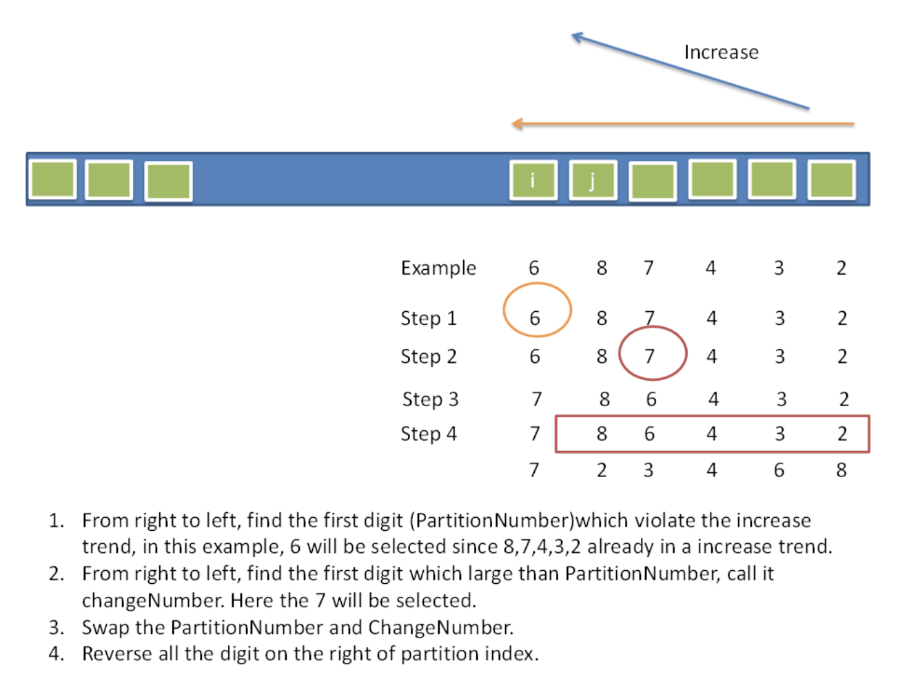

## Algorithm

[31. Next Permutation](https://leetcode.com/problems/next-permutation/)

### Description

Implement next permutation, which rearranges numbers into the lexicographically next greater permutation of numbers.

If such an arrangement is not possible, it must rearrange it as the lowest possible order (i.e., sorted in ascending order).

The replacement must be in place and use only constant extra memory.

Example 1:

```
Input: nums = [1,2,3]
Output: [1,3,2]
```

Example 2:

```
Input: nums = [3,2,1]
Output: [1,2,3]
```

Example 3:

```
Input: nums = [1,1,5]
Output: [1,5,1]
```

Example 4:

```
Input: nums = [1]
Output: [1]
```

Constraints:

- 1 <= nums.length <= 100
- 0 <= nums[i] <= 100

### Solution

```java
class Solution {
    public void nextPermutation(int[] nums) {
        if(nums == null || nums.length <= 1) return;
        int i = nums.length - 2;
        while(i >= 0 && nums[i] >= nums[i + 1]){
           i--; // 从前往后找到第一个降序的数字
        }
        if(i >= 0) {                                 // 如果不是完整的降序
            int j = nums.length - 1;                 // 从最后往前找
            while(nums[j] <= nums[i]){
               j--;           // 找到第一个比nums[i]大的数字
            }
            swap(nums, i, j);                        // 交换i和j
        }
        reverse(nums, i + 1, nums.length - 1);       // 后面的数字整体反转
    }

    public void swap(int[] nums, int i, int j) {
        int tmp = nums[i];
        nums[i] = nums[j];
        nums[j] = tmp;
    }

    public void reverse(int[] nums, int i, int j) {
        while(i < j) swap(nums, i++, j--);
    }
}
```

### Discuss

找到一个排列按照字母表顺序的情况下，下一个更大的排列是多少。如果已经是最大的，那么应该翻转。必须原地翻转。

先找到从后向前数，第一个降序的位置，把此位置后面的翻转。再把这个降序数字和后面第一个比它大的位置交换即可。

首先说一下这题怎么想到的。有如下的一个数组

1　　2　　7　　4　　3　　1

下一个排列为：

1　　3　　1　　2　　4　　7

观察可以发现，再给出的数组中，2之后的数字都是降序排列的，我们把2后面第一个比2大的数字放到最前面，然后让3后面的数字升序排列。

简单思路的证明：从7开始是降序的，也就是说7 4 3 1不可能通过重新排列构成更大的数字。如果要得到next permutation，那么必须把2这个位置的数字给换掉才行，而且只能换成比2大的数字在才能使next permutation > current permutation.至于换成多大的数字，很明显的需要换成在2后面的数字中刚好比2大的数字，证明可以使用反证法来说明换成其他数字要么比当前数字小，要么大于正确的next permutation.

下面这个做法是先逆序再交换，本质和上面的证明一样：

如果从第n个数字到最后都是递减的并且第n-1个数字小于第n个，说明从第n个数字开始的这段序列是字典序组合的最后一个，在下一个组合中他们要倒序变为字典序第一个，然后从这段序列中找出第一个大于第n-1个数字的数和第n-1个数字交换就可以了。

举个栗子，当前组合为12431，可以看出431是递减的，同时4>2，这样我们把431倒序，组合就变为12134，然后从134中找出第一个大于2的数字和2交换，这样就得到了下一个组合13124。对于完全递减的组合例如4321在倒序之后就可以结束了。



## Review


## Tip


## Share
