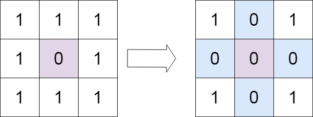
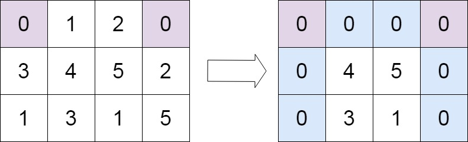

## Algorithm

[73. Set Matrix Zeroes](https://leetcode.com/problems/set-matrix-zeroes/)

### Description

Given an m x n integer matrix matrix, if an element is 0, set its entire row and column to 0's, and return the matrix.

You must do it in place.

Example 1:



```
Input: matrix = [[1,1,1],[1,0,1],[1,1,1]]
Output: [[1,0,1],[0,0,0],[1,0,1]]
```

Example 2:



```
Input: matrix = [[0,1,2,0],[3,4,5,2],[1,3,1,5]]
Output: [[0,0,0,0],[0,4,5,0],[0,3,1,0]]
```

Constraints:

- m == matrix.length
- n == matrix[0].length
- 1 <= m, n <= 200
- -231 <= matrix[i][j] <= 231 - 1


Follow up:

- A straightforward solution using O(mn) space is probably a bad idea.
- A simple improvement uses O(m + n) space, but still not the best solution.
- Could you devise a constant space solution?

### Solution

```java
class Solution {
    public void setZeroes(int[][] matrix) {
         if (matrix == null || matrix.length == 0 || matrix[0].length == 0) return;
         int m = matrix.length, n = matrix[0].length;
         boolean row = false, col = false;
         for (int i = 0; i < m; i++)
             for (int j = 0; j < n; j++){
                 if (matrix[i][j] == 0) {
                     matrix[0][j] = 0;
                     matrix[i][0] = 0;
                     if (i == 0) row = true;
                     if (j == 0) col = true;
                 }
             }
         for (int i = 1; i < m; i++){
             if (matrix[i][0] == 0){
                 for (int j = 1; j < n;j++)
                     matrix[i][j] = 0;
             }
         }
         for (int j = 1; j < n; j++){
             if (matrix[0][j] == 0){
                 for (int i = 1; i < m; i++)
                     matrix[i][j] = 0;
             }
         }
         if (row){
             for (int j = 0; j < n; j++)
                 matrix[0][j] = 0;
         }
         if (col){
             for(int i = 0; i < m; i++)
                 matrix[i][0] = 0;
         }
    }
}
```

### Discuss

## Review


## Tip


## Share
