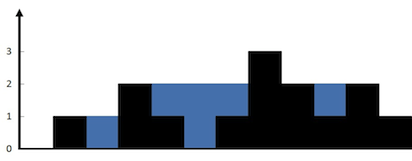

## Algorithm

[42. Trapping Rain Water](https://leetcode.com/problems/trapping-rain-water/)

### Description

Given n non-negative integers representing an elevation map where the width of each bar is 1, compute how much water it can trap after raining.

Example 1:



```
Input: height = [0,1,0,2,1,0,1,3,2,1,2,1]
Output: 6
Explanation: The above elevation map (black section) is represented by array [0,1,0,2,1,0,1,3,2,1,2,1]. In this case, 6 units of rain water (blue section) are being trapped.
```

Example 2:

```
Input: height = [4,2,0,3,2,5]
Output: 9
```

Constraints:

- n == height.length
- 1 <= n <= 2 * 104
- 0 <= height[i] <= 105

### Solution

```java
class Solution {
    public int trap(int[] height) {
        int left = 0, right = height.length - 1;
        int res = 0, maxleft = 0, maxright = 0;
        while (left <= right) {
            if (height[left] <= height[right]) {
                if (height[left] >= maxleft) {
                    maxleft = height[left];
                } else {
                    res += maxleft - height[left];
                }
                left++;
            }else {
               if (height[right] >= maxright) {
                   maxright = height[right];
               } else {
                   res += maxright - height[right];
               }
                right--;
            }
        }
        return res;
    }
}
```

### Discuss

1. 左右两边同时逼近中间
2. 左侧找最大值，右侧找最大值
3. (左侧最大值-左侧当前值)+(右侧最大值-右侧当前值)

## Review


## Tip


## Share
