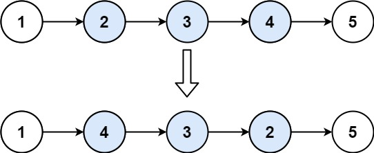

## Algorithm

[92. Reverse Linked List II](https://leetcode.com/problems/reverse-linked-list-ii/)

### Description

Given the head of a singly linked list and two integers left and right where left <= right, reverse the nodes of the list from position left to position right, and return the reversed list.

Example 1:



```
Input: head = [1,2,3,4,5], left = 2, right = 4
Output: [1,4,3,2,5]
```

Example 2:

```
Input: head = [5], left = 1, right = 1
Output: [5]
```

Constraints:

- The number of nodes in the list is n.
- 1 <= n <= 500
- -500 <= Node.val <= 500
- 1 <= left <= right <= n

Follow up: Could you do it in one pass?

### Solution

```java
/**
 * Definition for singly-linked list.
 * public class ListNode {
 *     int val;
 *     ListNode next;
 *     ListNode() {}
 *     ListNode(int val) { this.val = val; }
 *     ListNode(int val, ListNode next) { this.val = val; this.next = next; }
 * }
 */
class Solution {
    public ListNode reverseBetween(ListNode head, int left, int right) {
        ListNode temp = new ListNode(0);
        temp.next = head;

        ListNode cur1 = temp;
        ListNode pre1 = null;
        for(int i=0;i<left;i++){
             pre1 = cur1;
             cur1 = cur1.next;
        }
        //reverse
         ListNode cur2 = cur1;
         ListNode pre2 = pre1;
         for(int i=left;i<=right;i++){
             ListNode next = cur2.next;
             cur2.next = pre2;
             pre2 = cur2;
             cur2 = next;
         }

         //connect
         pre1.next = pre2;
         cur1.next = cur2;
         return temp.next;
    }
}
```

单个反转链表

```Java
/**
 * Definition for singly-linked list.
 * public class ListNode {
 *     int val;
 *     ListNode next;
 *     ListNode() {}
 *     ListNode(int val) { this.val = val; }
 *     ListNode(int val, ListNode next) { this.val = val; this.next = next; }
 * }
 */
class Solution {
    public ListNode reverseList(ListNode head){
       if(head==null || head.next == null){
           return head;
       }
       ListNode pre = null;
       ListNode cur = head;
       while(cur != null){
           ListNode next = cur.next;
           cur.next = pre;
           pre = cur;
           cur = next;
       }
       return pre;
    }
}
```

### Discuss

## Review


## Tip


## Share
