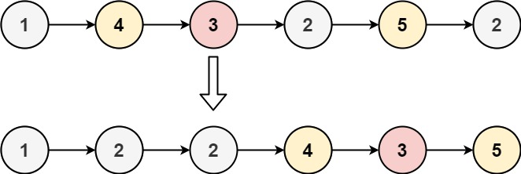

## Algorithm

[86. Partition List](https://leetcode.com/problems/partition-list/)

### Description

Given the head of a linked list and a value x, partition it such that all nodes less than x come before nodes greater than or equal to x.

You should preserve the original relative order of the nodes in each of the two partitions.

Example 1:



```
Input: head = [1,4,3,2,5,2], x = 3
Output: [1,2,2,4,3,5]
```

Example 2:

```
Input: head = [2,1], x = 2
Output: [1,2]
```

Constraints:

- The number of nodes in the list is in the range [0, 200].
- -100 <= Node.val <= 100
- -200 <= x <= 200

### Solution

```java
/**
 * Definition for singly-linked list.
 * public class ListNode {
 *     int val;
 *     ListNode next;
 *     ListNode() {}
 *     ListNode(int val) { this.val = val; }
 *     ListNode(int val, ListNode next) { this.val = val; this.next = next; }
 * }
 */
class Solution {
    public ListNode partition(ListNode head, int x) {
        ListNode less = new ListNode(0);
        ListNode greater = new ListNode(0);
        ListNode curr1 = less, curr2 = greater;

        while (head!=null) {
            if (head.val<x) {
                curr1.next = new ListNode(head.val);
                curr1 = curr1.next;
            }else {
                curr2.next = new ListNode(head.val);
                curr2 = curr2.next;
            }
            head = head.next;
        }
        curr1.next = greater.next;
        return less.next;
    }
}
```

### Discuss

## Review


## Tip


## Share
