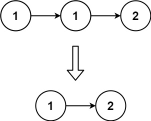
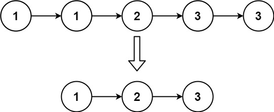

## Algorithm

[83. Remove Duplicates from Sorted List](https://leetcode.com/problems/remove-duplicates-from-sorted-list/)

### Description

Given the head of a sorted linked list, delete all duplicates such that each element appears only once. Return the linked list sorted as well.

Example 1:



```
Input: head = [1,1,2]
Output: [1,2]
```

Example 2:



```
Input: head = [1,1,2,3,3]
Output: [1,2,3]
```

Constraints:

- The number of nodes in the list is in the range [0, 300].
- -100 <= Node.val <= 100
- The list is guaranteed to be sorted in ascending order.

### Solution

```java
/**
 * Definition for singly-linked list.
 * public class ListNode {
 *     int val;
 *     ListNode next;
 *     ListNode(int x) { val = x; }
 * }
 */
class Solution {
    public ListNode deleteDuplicates(ListNode head) {
        if(head==null||head.next==null) return head;
        ListNode pre = head;
        while(pre.next!=null){
            if(pre.val==pre.next.val){
                pre.next = pre.next.next;
            }else{
                pre = pre.next;
            }
        }
        return head;
    }
}
```

### Discuss

## Review


## Tip


## Share
