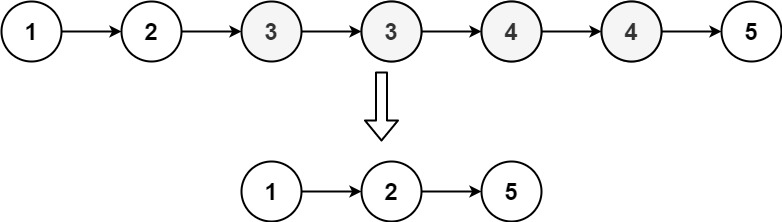
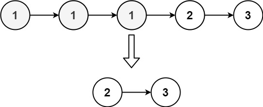

## Algorithm

[82. Remove Duplicates from Sorted List II](https://leetcode.com/problems/remove-duplicates-from-sorted-list-ii/)

### Description

Given the head of a sorted linked list, delete all nodes that have duplicate numbers, leaving only distinct numbers from the original list. Return the linked list sorted as well.

Example 1:



```
Input: head = [1,2,3,3,4,4,5]
Output: [1,2,5]
```

Example 2:



```
Input: head = [1,1,1,2,3]
Output: [2,3]
```

Constraints:

- The number of nodes in the list is in the range [0, 300].
- -100 <= Node.val <= 100
- The list is guaranteed to be sorted in ascending order.

### Solution

```java
/**
 * Definition for singly-linked list.
 * public class ListNode {
 *     int val;
 *     ListNode next;
 *     ListNode() {}
 *     ListNode(int val) { this.val = val; }
 *     ListNode(int val, ListNode next) { this.val = val; this.next = next; }
 * }
 */
class Solution {
    public ListNode deleteDuplicates(ListNode head) {
        ListNode dummy = new ListNode(0), fast = head, slow = dummy;
        slow.next = fast;
        while(fast != null) {
            while (fast.next != null && fast.val == fast.next.val) {
                //while loop to find the last node of the dups.
     		    fast = fast.next;    
    	    }
            if (slow.next != fast) { //duplicates detected.
    		    slow.next = fast.next; //remove the dups.
    		    fast = slow.next;     //reposition the fast pointer.
    	    }else {
                //no dup, move down both pointer.
    		    slow = slow.next;
    		    fast = fast.next;
    	    }
        }
        return dummy.next;
    }
}
```

### Discuss

## Review


## Tip


## Share
