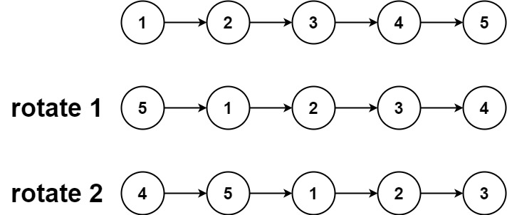

## Algorithm

[61. Rotate List](https://leetcode.com/problems/rotate-list/)

### Description

Given the head of a linked list, rotate the list to the right by k places.


Example 1:



```
Input: head = [1,2,3,4,5], k = 2
Output: [4,5,1,2,3]
```

Example 2:


```
Input: head = [0,1,2], k = 4
Output: [2,0,1]
```

Constraints:

- The number of nodes in the list is in the range [0, 500].
- -100 <= Node.val <= 100
- 0 <= k <= 2 * 109

### Solution

```java
/**
 * Definition for singly-linked list.
 * public class ListNode {
 *     int val;
 *     ListNode next;
 *     ListNode() {}
 *     ListNode(int val) { this.val = val; }
 *     ListNode(int val, ListNode next) { this.val = val; this.next = next; }
 * }
 */
class Solution {
    public ListNode rotateRight(ListNode head, int k) {
        if(head == null || head.next == null || k == 0){
            return head;
        }
        ListNode end = head;
        ListNode newhead = head;
        ListNode newend = head;
        int listLength = 1;
        while(end.next != null){
            end = end.next;
            listLength++;
        }
        end.next = head; // make it a circle here
        for(int i = 0; i < listLength - (k % listLength); i++){
            newend = newhead;
            newhead = newhead.next;   
        }
        //end.next = head; when i put it here rather than the place above, it cannot pass, i don't know why. can you help me? why should we make a circle?
        newend.next = null;
        return newhead;
    }
}
```

### Discuss

先遍历一遍，得到链表长度为len，注意k可能大于len，因此k=k%len, 将尾节点next指针指向首节点，形成一个环，接着往后走len-k步，从这里断开就是要求的结果。
## Review


## Tip


## Share
