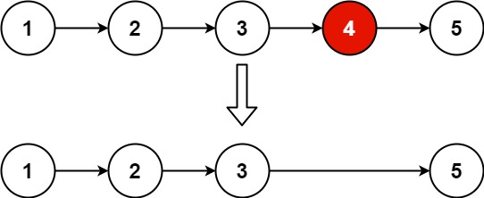

## Algorithm

[19. Remove Nth Node From End of List](https://leetcode.com/problems/remove-nth-node-from-end-of-list/)

### Description

Given the head of a linked list, remove the nth node from the end of the list and return its head.

Example 1:



```
Input: head = [1,2,3,4,5], n = 2
Output: [1,2,3,5]
```

Example 2:

```
Input: head = [1], n = 1
Output: []
```

Example 3:

```
Input: head = [1,2], n = 1
Output: [1]
```

Constraints:

- The number of nodes in the list is sz.
- 1 <= sz <= 30
- 0 <= Node.val <= 100
- 1 <= n <= sz

Follow up: Could you do this in one pass?

### Solution

```java
/**
 * Definition for singly-linked list.
 * public class ListNode {
 *     int val;
 *     ListNode next;
 *     ListNode(int x) { val = x; }
 * }
 */
class Solution {
    public ListNode removeNthFromEnd(ListNode head, int n) {
        ListNode first = head;
        ListNode res = new ListNode(0);
        res.next = head;
        ListNode second = res;
        while(first!=null){
            first = first.next;
            if(n--<=0){
                second = second.next;
            }
        }
        second.next = second.next.next;
        return res.next;
    }
}
```

### Discuss

## Review


## Tip


## Share
