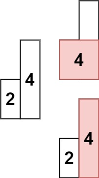
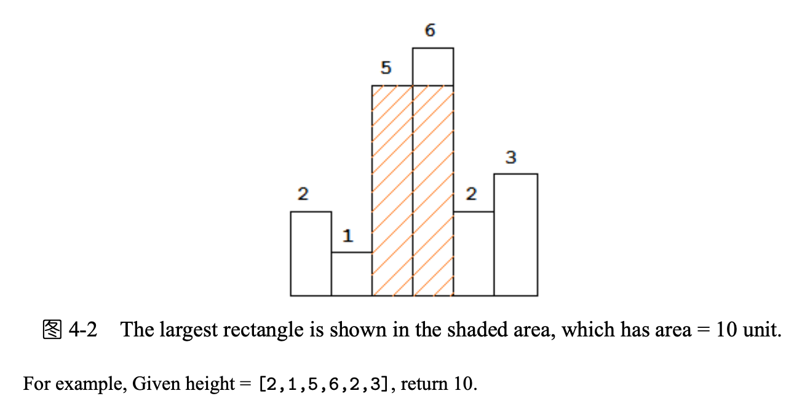

## Algorithm

[84. Largest Rectangle in Histogram](https://leetcode.com/problems/largest-rectangle-in-histogram/)

### Description

Given an array of integers heights representing the histogram's bar height where the width of each bar is 1, return the area of the largest rectangle in the histogram.

Example 1:


```
Input: heights = [2,1,5,6,2,3]
Output: 10
Explanation: The above is a histogram where width of each bar is 1.
The largest rectangle is shown in the red area, which has an area = 10 units.
```

Example 2:



```
Input: heights = [2,4]
Output: 4
```

Constraints:

- 1 <= heights.length <= 105
- 0 <= heights[i] <= 104

### Solution

```java
class Solution {
    public int largestRectangleArea(int[] heights) {
        int size = heights.length;
        Stack<Integer> stack = new Stack<>();
        stack.push(-1);
        int max = 0;
        for (int i = 0; i < size; ++i){
            // 当前元素小于栈顶元素
            while (stack.peek() != -1 && heights[i] < heights[stack.peek()]){
                // 弹出栈顶元素
                int h = heights[stack.pop()];
                // 计算当前宽度
                int w = i - stack.peek() - 1;
                // 计算最大值
                max = Math.max(max, w * h);
            }
            stack.push(i);
        }

        while (stack.peek() != -1){
            int h = heights[stack.pop()];
            int w = size - stack.peek() - 1;
            max = Math.max(max, w * h);
        }
        return max;
    }
}
```

### Discuss



从左到右处理直方，当i=4时，小于栈顶元素（直方3），对于直方3无论是后面还是前面的直方，都不可能得到比目前更高的高度了，因此计算直方3到直方4的面积，然后从栈弹出，对于直方2也是如此，直到碰到比直方4更矮的直方1

可以维护一个递增的栈，每次比较栈顶与当前元素，如果当前元素大于栈顶元素，则入栈，否则合并现有的栈，直到栈顶元素小于当前元素，结尾时入栈元素为0，重复合并。

## Review


## Tip


## Share
