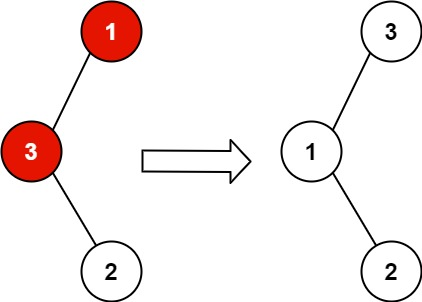

## Algorithm

[99. Recover Binary Search Tree](https://leetcode.com/problems/recover-binary-search-tree/)

### Description

You are given the root of a binary search tree (BST), where the values of exactly two nodes of the tree were swapped by mistake. Recover the tree without changing its structure.

Example 1:



```
Input: root = [1,3,null,null,2]
Output: [3,1,null,null,2]
Explanation: 3 cannot be a left child of 1 because 3 > 1. Swapping 1 and 3 makes the BST valid.
```

Example 2:

```
Input: root = [3,1,4,null,null,2]
Output: [2,1,4,null,null,3]
Explanation: 2 cannot be in the right subtree of 3 because 2 < 3. Swapping 2 and 3 makes the BST valid.
```

Constraints:

- The number of nodes in the tree is in the range [2, 1000].
- -231 <= Node.val <= 231 - 1


Follow up: A solution using O(n) space is pretty straight-forward. Could you devise a constant O(1) space solution?

### Solution

```java
/**
 * Definition for a binary tree node.
 * public class TreeNode {
 *     int val;
 *     TreeNode left;
 *     TreeNode right;
 *     TreeNode() {}
 *     TreeNode(int val) { this.val = val; }
 *     TreeNode(int val, TreeNode left, TreeNode right) {
 *         this.val = val;
 *         this.left = left;
 *         this.right = right;
 *     }
 * }
 */
class Solution {
    private TreeNode first;
    private TreeNode second;
    private TreeNode pre;
    public void recoverTree(TreeNode root) {
        if(root==null) return;
        first = null;
        second = null;
        pre = null;
        inorder(root);
        int temp = first.val;
        first.val = second.val;
        second.val = temp;
    }

    private void inorder(TreeNode root){
        if(root==null) return;
        inorder(root.left);

        if(first==null && (pre==null ||pre.val>=root.val)){
            first = pre;
        }
        if(first!=null && pre.val>=root.val){
            second = root;
        }
        pre = root;
        inorder(root.right);
    }
}
```

### Discuss

将节点指针放在数组里，寻找两个逆向的位置，先从前往后找到第一个逆序的位置，然后从后往前找到第二个逆序的位置，交换两个指针的值

## Review


## Tip


## Share
