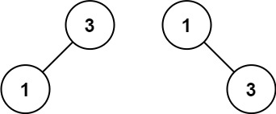

## Algorithm

[108. Convert Sorted Array to Binary Search Tree](https://leetcode.com/problems/convert-sorted-array-to-binary-search-tree/)

### Description

Given an integer array nums where the elements are sorted in ascending order, convert it to a height-balanced binary search tree.

A height-balanced binary tree is a binary tree in which the depth of the two subtrees of every node never differs by more than one.

Example 1:


```
Input: nums = [-10,-3,0,5,9]
Output: [0,-3,9,-10,null,5]
Explanation: [0,-10,5,null,-3,null,9] is also accepted:
```


Example 2:



```
Input: nums = [1,3]
Output: [3,1]
Explanation: [1,3] and [3,1] are both a height-balanced BSTs.
```

Constraints:

- 1 <= nums.length <= 104
- -104 <= nums[i] <= 104
- nums is sorted in a strictly increasing order.

### Solution

```java
/**
 * Definition for a binary tree node.
 * public class TreeNode {
 *     int val;
 *     TreeNode left;
 *     TreeNode right;
 *     TreeNode(int x) { val = x; }
 * }
 */
class Solution {
    public TreeNode sortedArrayToBST(int[] nums) {
         return buildTree(nums, 0 , nums.length-1);
    }
    public TreeNode buildTree(int[] nums, int low, int high){
        if(low>high){
            return null;
        }
        int mid = (low+high)/2;
        TreeNode node = new TreeNode(nums[mid]);
        node.left = buildTree(nums, low, mid-1);
        node.right = buildTree(nums, mid+1, high);
        return node;
    }
}
```

### Discuss

## Review


## Tip


## Share
