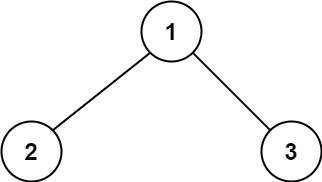
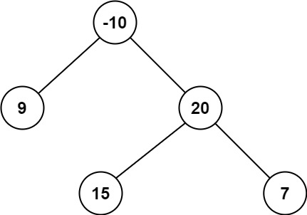

## Algorithm

[124. Binary Tree Maximum Path Sum](https://leetcode.com/problems/binary-tree-maximum-path-sum/)

### Description

A path in a binary tree is a sequence of nodes where each pair of adjacent nodes in the sequence has an edge connecting them. A node can only appear in the sequence at most once. Note that the path does not need to pass through the root.

The path sum of a path is the sum of the node's values in the path.

Given the root of a binary tree, return the maximum path sum of any non-empty path.

Example 1:



```
Input: root = [1,2,3]
Output: 6
Explanation: The optimal path is 2 -> 1 -> 3 with a path sum of 2 + 1 + 3 = 6.
```

Example 2:



```
Input: root = [-10,9,20,null,null,15,7]
Output: 42
Explanation: The optimal path is 15 -> 20 -> 7 with a path sum of 15 + 20 + 7 = 42.
```

Constraints:

- The number of nodes in the tree is in the range [1, 3 * 104].
- -1000 <= Node.val <= 1000

### Solution

```java
/**
 * Definition for a binary tree node.
 * public class TreeNode {
 *     int val;
 *     TreeNode left;
 *     TreeNode right;
 *     TreeNode() {}
 *     TreeNode(int val) { this.val = val; }
 *     TreeNode(int val, TreeNode left, TreeNode right) {
 *         this.val = val;
 *         this.left = left;
 *         this.right = right;
 *     }
 * }
 */
class Solution {

    private int maxValue = Integer.MIN_VALUE;;

    public int maxPathSum(TreeNode root){
        maxPathDown(root);
        return maxValue;
    }

    private int maxPathDown(TreeNode node) {
        if(node == null){
            return 0;
        }
        int left = Math.max(0, maxPathDown(node.left));
        int right = Math.max(0, maxPathDown(node.right));
        maxValue = Math.max(maxValue, left + right + node.val);
        return Math.max(left, right) + node.val;
    }
}
```

### Discuss

## Review


## Tip


## Share
