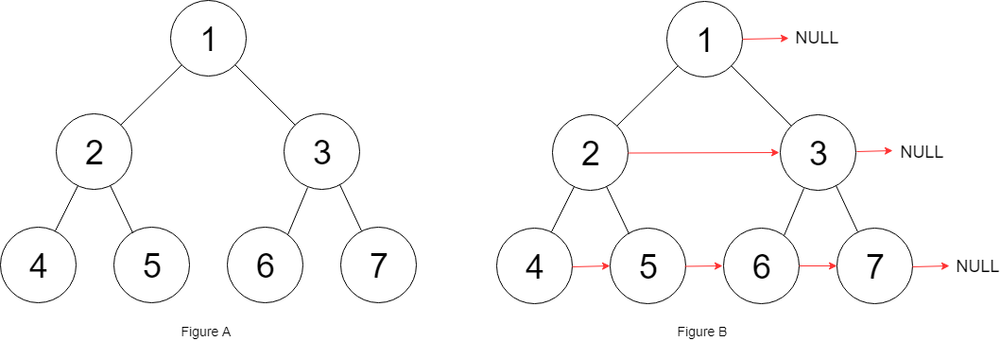

## Algorithm

[116. Populating Next Right Pointers in Each Node](https://leetcode.com/problems/populating-next-right-pointers-in-each-node/)

### Description

You are given a perfect binary tree where all leaves are on the same level, and every parent has two children. The binary tree has the following definition:

```
struct Node {
  int val;
  Node *left;
  Node *right;
  Node *next;
}
```

Populate each next pointer to point to its next right node. If there is no next right node, the next pointer should be set to NULL.

Initially, all next pointers are set to NULL.


Example 1:



```
Input: root = [1,2,3,4,5,6,7]
Output: [1,#,2,3,#,4,5,6,7,#]
Explanation: Given the above perfect binary tree (Figure A), your function should populate each next pointer to point to its next right node, just like in Figure B. The serialized output is in level order as connected by the next pointers, with '#' signifying the end of each level.
```

Example 2:

```
Input: root = []
Output: []
```

Constraints:

- The number of nodes in the tree is in the range [0, 212 - 1].
- -1000 <= Node.val <= 1000


Follow-up:

- You may only use constant extra space.
- The recursive approach is fine. You may assume implicit stack space does not count as extra space for this problem.

### Solution

```java
/*
// Definition for a Node.
class Node {
    public int val;
    public Node left;
    public Node right;
    public Node next;

    public Node() {}

    public Node(int _val,Node _left,Node _right,Node _next) {
        val = _val;
        left = _left;
        right = _right;
        next = _next;
    }
};
*/
class Solution {
    public Node connect(Node root) {
      if(root == null) return root;    
      helper(root.left, root.right);
      return root;
    }

    void helper(Node node1, Node node2){
      if(node1 == null) return;    
      node1.next = node2;
      helper(node1.left, node1.right);
      helper(node2.left, node2.right);
      helper(node1.right, node2.left);
    }
}
```

### Discuss

## Review


## Tip


## Share
