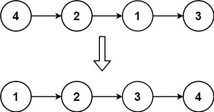
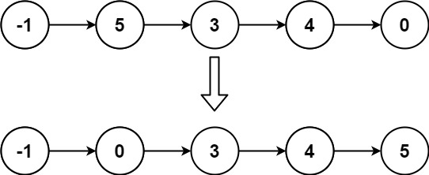

## Algorithm

[147. Insertion Sort List](https://leetcode.com/problems/insertion-sort-list/)

### Description

Given the head of a singly linked list, sort the list using insertion sort, and return the sorted list's head.

The steps of the insertion sort algorithm:

1. Insertion sort iterates, consuming one input element each repetition and growing a sorted output list.
2. At each iteration, insertion sort removes one element from the input data, finds the location it belongs within the sorted list and inserts it there.
3. It repeats until no input elements remain.

The following is a graphical example of the insertion sort algorithm. The partially sorted list (black) initially contains only the first element in the list. One element (red) is removed from the input data and inserted in-place into the sorted list with each iteration.


Example 1:



```
Input: head = [4,2,1,3]
Output: [1,2,3,4]
```

Example 2:



```
Input: head = [-1,5,3,4,0]
Output: [-1,0,3,4,5]
```

Constraints:

- The number of nodes in the list is in the range [1, 5000].
- -5000 <= Node.val <= 5000

### Solution

```java
/**
 * Definition for singly-linked list.
 * public class ListNode {
 *     int val;
 *     ListNode next;
 *     ListNode() {}
 *     ListNode(int val) { this.val = val; }
 *     ListNode(int val, ListNode next) { this.val = val; this.next = next; }
 * }
 */
class Solution {
    public ListNode insertionSortList(ListNode head) {
        ListNode helper=new ListNode(0);
        ListNode pre=helper;
        ListNode current=head;
        while(current!=null) {
            pre=helper;
            while(pre.next!=null&&pre.next.val<current.val) {
                pre=pre.next;
            }
            ListNode next=current.next;
            current.next=pre.next;
            pre.next=current;
            current=next;
        }
        return helper.next;
    }
}
```

### Discuss

插入排序的思想，注意定义一个新的辅助链表，两个指针递归执行

## Review


## Tip


## Share
