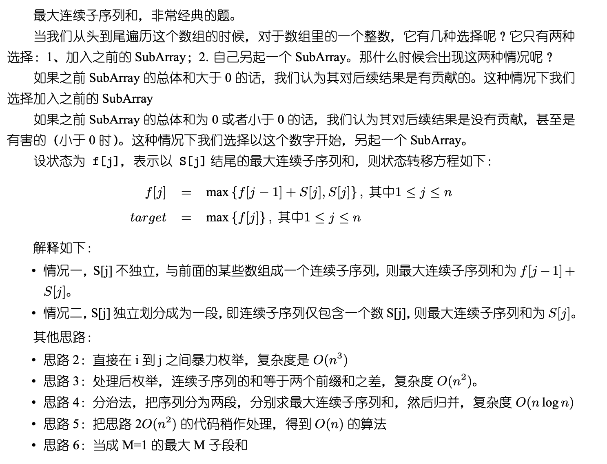

## Algorithm

[53. Maximum Subarray](https://leetcode.com/problems/maximum-subarray/)

### Description

Given an integer array nums, find the contiguous subarray (containing at least one number) which has the largest sum and return its sum.

A subarray is a contiguous part of an array.


Example 1:

```
Input: nums = [-2,1,-3,4,-1,2,1,-5,4]
Output: 6
Explanation: [4,-1,2,1] has the largest sum = 6.
```

Example 2:

```
Input: nums = [1]
Output: 1
```

Example 3:

```
Input: nums = [5,4,-1,7,8]
Output: 23
```

Constraints:

- 1 <= nums.length <= 105
- -104 <= nums[i] <= 104


Follow up: If you have figured out the O(n) solution, try coding another solution using the divide and conquer approach, which is more subtle.

### Solution

```java
class Solution {
    public int maxSubArray(int[] nums) {
        if(nums==null||nums.length==0){
            return 0;
        }
        int sum = nums[0];
        int max = nums[0];
        for(int i=1;i<nums.length;i++){
            if(sum + nums[i] > nums[i]){
                sum += nums[i];
            }else{
                sum = nums[i];
            }
            max = Math.max(sum, max);
        }
        return max;
    }
}
```

### Discuss



## Review


## Tip


## Share
