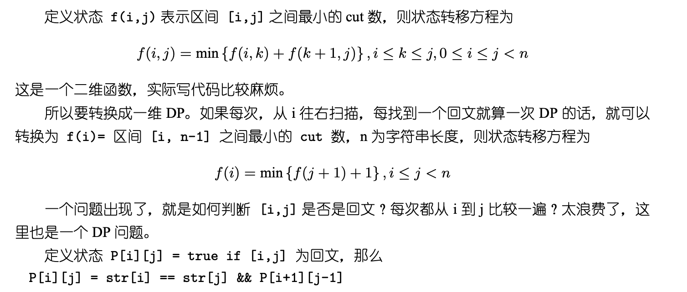

## Algorithm

[132. Palindrome Partitioning II](https://leetcode.com/problems/palindrome-partitioning-ii/)

### Description

Given a string s, partition s such that every substring of the partition is a palindrome.

Return the minimum cuts needed for a palindrome partitioning of s.

Example 1:

```
Input: s = "aab"
Output: 1
Explanation: The palindrome partitioning ["aa","b"] could be produced using 1 cut.
```

Example 2:

```
Input: s = "a"
Output: 0
```

Example 3:

```
Input: s = "ab"
Output: 1
```

Constraints:

- 1 <= s.length <= 2000
- s consists of lowercase English letters only.

### Solution

```java
class Solution {
    public int minCut(String s) {
        char[] c = s.toCharArray();
        int n = c.length;
        int[] cut = new int[n];
        boolean[][] pal = new boolean[n][n];

        for(int i = 0; i < n; i++) {
            int min = i;
            for(int j = 0; j <= i; j++) {
                if(c[j] == c[i] && (j + 1 > i - 1 || pal[j + 1][i - 1])) {
                    pal[j][i] = true;  
                    min = j == 0 ? 0 : Math.min(min, cut[j - 1] + 1);
                }
            }
            cut[i] = min;
        }
        return cut[n - 1];
    }
}
```

### Discuss



This can be solved by two points:

1. cut[i] is the minimum of cut[j - 1] + 1 (j <= i), if [j, i] is palindrome.
2. If [j, i] is palindrome, [j + 1, i - 1] is palindrome, and c[j] == c[i].

The 2nd point reminds us of using dp (caching).

```
a   b   a   |   c  c
                j  i
       j-1  |  [j, i] is palindrome
   cut(j-1) +  1
```

## Review


## Tip


## Share
