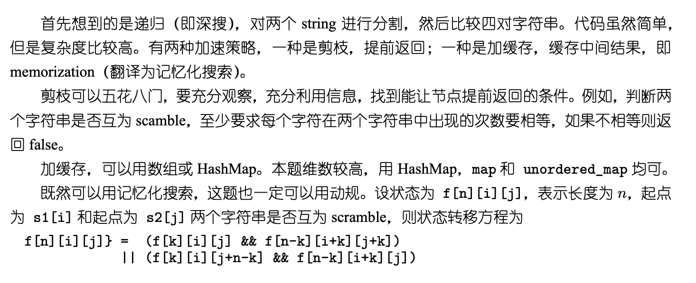

## Algorithm

[87. Scramble String](https://leetcode.com/problems/scramble-string/)

### Description

We can scramble a string s to get a string t using the following algorithm:

1. If the length of the string is 1, stop.
2. If the length of the string is > 1, do the following:
- Split the string into two non-empty substrings at a random index, i.e., if the string is s, divide it to x and y where s = x + y.
- Randomly decide to swap the two substrings or to keep them in the same order. i.e., after this step, s may become s = x + y or s = y + x.
- Apply step 1 recursively on each of the two substrings x and y.
- Given two strings s1 and s2 of the same length, return true if s2 is a scrambled string of s1, otherwise, return false.

Example 1:

```
Input: s1 = "great", s2 = "rgeat"
Output: true
Explanation: One possible scenario applied on s1 is:
"great" --> "gr/eat" // divide at random index.
"gr/eat" --> "gr/eat" // random decision is not to swap the two substrings and keep them in order.
"gr/eat" --> "g/r / e/at" // apply the same algorithm recursively on both substrings. divide at ranom index each of them.
"g/r / e/at" --> "r/g / e/at" // random decision was to swap the first substring and to keep the second substring in the same order.
"r/g / e/at" --> "r/g / e/ a/t" // again apply the algorithm recursively, divide "at" to "a/t".
"r/g / e/ a/t" --> "r/g / e/ a/t" // random decision is to keep both substrings in the same order.
The algorithm stops now and the result string is "rgeat" which is s2.
As there is one possible scenario that led s1 to be scrambled to s2, we return true.
```

Example 2:

```
Input: s1 = "abcde", s2 = "caebd"
Output: false
```

Example 3:

```
Input: s1 = "a", s2 = "a"
Output: true
```

Constraints:

- s1.length == s2.length
- 1 <= s1.length <= 30
- s1 and s2 consist of lower-case English letters.

### Solution

```java
class Solution {
    public boolean isScramble(String s1, String s2) {
        int n = s1.length(), m = s2.length();
        if(n != m){
            return false;
        }
        if(n == 0) {
            return true;
        }
        if(s1.equals(s2)) {
            return true;
        }
        int[] freq = new int[26];
        for(int i = 0; i < n; i++){
            freq[s1.charAt(i) - 97]++;
            freq[s2.charAt(i) - 97]--;
        }
        // if freq[i] != 0  => different characters, hence node equality condition is violated.
        for(int i = 0; i < n; i++) {
            if(freq[s1.charAt(i) - 97] != 0){
                return false;
            }
        }
        // The following loop has conditions similar to what we use for mirror trees.
        for(int i = 1; i < n; i++){
            if(isScramble(s1.substring(0,i),s2.substring(0,i))
                    && isScramble(s1.substring(i),s2.substring(i))) {
                return true;
            }
            if(isScramble(s1.substring(0,i),s2.substring(n - i))
                    && isScramble(s1.substring(i),s2.substring(0,n - i))) {
                return true;
            }
        }
        return false;
    }
}
```

### Discuss



## Review


## Tip


## Share
