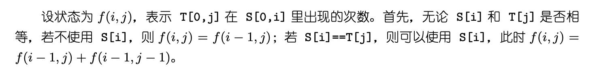

## Algorithm

[115. Distinct Subsequences](https://leetcode.com/problems/distinct-subsequences/)

### Description

Given two strings s and t, return the number of distinct subsequences of s which equals t.

A string's subsequence is a new string formed from the original string by deleting some (can be none) of the characters without disturbing the remaining characters' relative positions. (i.e., "ACE" is a subsequence of "ABCDE" while "AEC" is not).

The test cases are generated so that the answer fits on a 32-bit signed integer.

Example 1:

```
Input: s = "rabbbit", t = "rabbit"
Output: 3
Explanation:
As shown below, there are 3 ways you can generate "rabbit" from S.
rabbbit
rabbbit
rabbbit
```

Example 2:

```
Input: s = "babgbag", t = "bag"
Output: 5
Explanation:
As shown below, there are 5 ways you can generate "bag" from S.
babgbag
babgbag
babgbag
babgbag
babgbag
```

Constraints:

- 1 <= s.length, t.length <= 1000
- s and t consist of English letters.

### Solution

```java
class Solution {
    public int numDistinct(String s, String t) {
        // array creation
        int[][] mem = new int[t.length()+1][s.length()+1];

        // filling the first row: with 1s
        for(int j=0; j<=s.length(); j++) {
            mem[0][j] = 1;
        }

        // the first column is 0 by default in every other rows but the first, which we need.

        for(int i=0; i<t.length(); i++) {
            for(int j=0; j<s.length(); j++) {
                if(t.charAt(i) == s.charAt(j)) {
                    mem[i+1][j+1] = mem[i][j] + mem[i+1][j];
                } else {
                    mem[i+1][j+1] = mem[i+1][j];
                }
            }
        }

        return mem[t.length()][s.length()];
    }
}
```

### Discuss

The idea is the following:

we will build an array mem where mem[i+1][j+1] means that S[0..j] contains T[0..i] that many times as distinct subsequences. Therefor the result will be mem[T.length()][S.length()].
we can build this array rows-by-rows:
the first row must be filled with 1. That's because the empty string is a subsequence of any string but only 1 time. So mem[0][j] = 1 for every j. So with this we not only make our lives easier, but we also return correct value if T is an empty string.
the first column of every rows except the first must be 0. This is because an empty string cannot contain a non-empty string as a substring -- the very first item of the array: mem[0][0] = 1, because an empty string contains the empty string 1 time.
So the matrix looks like this:

```
  S 0123....j
T +----------+
  |1111111111|
0 |0         |
1 |0         |
2 |0         |
. |0         |
. |0         |
i |0         |
```

From here we can easily fill the whole grid: for each (x, y), we check if S[x] == T[y] we add the previous item and the previous item in the previous row, otherwise we copy the previous item in the same row. The reason is simple:

if the current character in S doesn't equal to current character T, then we have the same number of distinct subsequences as we had without the new character.
if the current character in S equal to the current character T, then the distinct number of subsequences: the number we had before plus the distinct number of subsequences we had with less longer T and less longer S.
An example:
S: [acdabefbc] and T: [ab]

first we check with a:

```
           *  *
      S = [acdabefbc]
mem[1] = [0111222222]
```

then we check with ab:

```
               *  * ]
      S = [acdabefbc]
mem[1] = [0111222222]
mem[2] = [0000022244]
```

And the result is 4, as the distinct subsequences are:

```
      S = [a   b    ]
      S = [a      b ]
      S = [   ab    ]
      S = [   a   b ]
```

## Review



## Tip


## Share
