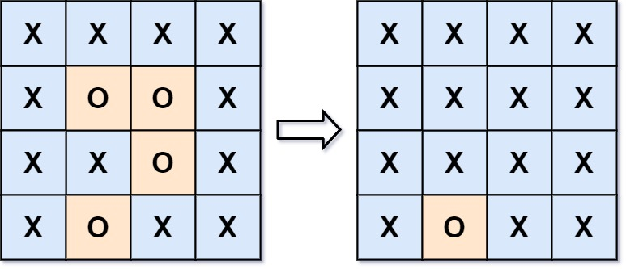

## Algorithm

[130. Surrounded Regions](https://leetcode.com/problems/surrounded-regions/)

### Description

Given an m x n matrix board containing 'X' and 'O', capture all regions that are 4-directionally surrounded by 'X'.

A region is captured by flipping all 'O's into 'X's in that surrounded region.

Example 1:



```
Input: board = [["X","X","X","X"],["X","O","O","X"],["X","X","O","X"],["X","O","X","X"]]
Output: [["X","X","X","X"],["X","X","X","X"],["X","X","X","X"],["X","O","X","X"]]
Explanation: Surrounded regions should not be on the border, which means that any 'O' on the border of the board are not flipped to 'X'. Any 'O' that is not on the border and it is not connected to an 'O' on the border will be flipped to 'X'. Two cells are connected if they are adjacent cells connected horizontally or vertically.
```

Example 2:

```
Input: board = [["X"]]
Output: [["X"]]
```

Constraints:

- m == board.length
- n == board[i].length
- 1 <= m, n <= 200
- board[i][j] is 'X' or 'O'.

### Solution

```java
public class Solution {
    public void solve(char[][] board) {
        if (board.length == 0) return;

        int rowN = board.length;
        int colN = board[0].length;
        Queue<Point> queue = new LinkedList<Point>();

       //get all 'O's on the edge first
        for (int r = 0; r< rowN; r++){
        	if (board[r][0] == 'O') {
        		board[r][0] = '+';
                queue.add(new Point(r, 0));
        	}
        	if (board[r][colN-1] == 'O') {
        		board[r][colN-1] = '+';
                queue.add(new Point(r, colN-1));
        	}
        	}

        for (int c = 0; c< colN; c++){
        	if (board[0][c] == 'O') {
        		board[0][c] = '+';
                queue.add(new Point(0, c));
        	}
        	if (board[rowN-1][c] == 'O') {
        		board[rowN-1][c] = '+';
                queue.add(new Point(rowN-1, c));
        	}
        }


        //BFS for the 'O's, and mark it as '+'
        while (!queue.isEmpty()){
        	Point p = queue.poll();
        	int row = p.x;
        	int col = p.y;
        	if (row - 1 >= 0 && board[row-1][col] == 'O') {board[row-1][col] = '+'; queue.add(new Point(row-1, col));}
        	if (row + 1 < rowN && board[row+1][col] == 'O') {board[row+1][col] = '+'; queue.add(new Point(row+1, col));}
        	if (col - 1 >= 0 && board[row][col - 1] == 'O') {board[row][col-1] = '+'; queue.add(new Point(row, col-1));}
            if (col + 1 < colN && board[row][col + 1] == 'O') {board[row][col+1] = '+'; queue.add(new Point(row, col+1));}        	      
        }

        //turn all '+' to 'O', and 'O' to 'X'
        for (int i = 0; i<rowN; i++){
        	for (int j=0; j<colN; j++){
        		if (board[i][j] == 'O') board[i][j] = 'X';
        		if (board[i][j] == '+') board[i][j] = 'O';
        	}
        }  
    }
}
```

### Discuss

## Review


## Tip


## Share
