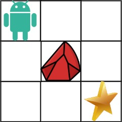

## Algorithm

[63. Unique Paths II](https://leetcode.com/problems/unique-paths-ii/)

### Description

A robot is located at the top-left corner of a m x n grid (marked 'Start' in the diagram below).

The robot can only move either down or right at any point in time. The robot is trying to reach the bottom-right corner of the grid (marked 'Finish' in the diagram below).

Now consider if some obstacles are added to the grids. How many unique paths would there be?

An obstacle and space is marked as 1 and 0 respectively in the grid.

Example 1:



```
Input: obstacleGrid = [[0,0,0],[0,1,0],[0,0,0]]
Output: 2
Explanation: There is one obstacle in the middle of the 3x3 grid above.
There are two ways to reach the bottom-right corner:
1. Right -> Right -> Down -> Down
2. Down -> Down -> Right -> Right
```

Example 2:


```
Input: obstacleGrid = [[0,1],[0,0]]
Output: 1
```

Constraints:

- m == obstacleGrid.length
- n == obstacleGrid[i].length
- 1 <= m, n <= 100
- obstacleGrid[i][j] is 0 or 1.

### Solution

```java
class Solution {
    public int uniquePathsWithObstacles(int[][] obstacleGrid) {
        int m = obstacleGrid.length;
        if (m == 0) {
            return 0;
        }
        int n = obstacleGrid[0].length;
        int[][] dp = new int[m][n];
        dp[0][0] = obstacleGrid[0][0] == 1 ? 0 : 1;
        for (int i = 0; i < m; i++) {
            for (int j = 0; j < n; j++) {
                if (i + j == 0) {
                    continue;
                }
                if (i == 0) {
                    dp[i][j] = obstacleGrid[i][j] == 1 ? 0 : dp[i][j - 1];
                } else if (j == 0) {
                    dp[i][j] = obstacleGrid[i][j] == 1 ? 0 : dp[i - 1][j];
                } else {
                    dp[i][j] = obstacleGrid[i][j] == 1 ? 0 : dp[i - 1][j] + dp[i][j - 1];
                }
            }
        }
        return dp[m - 1][n - 1];
    }
}
```

### Discuss

## Review


## Tip


## Share
