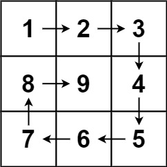

## Algorithm

[59. Spiral Matrix II](https://leetcode.com/problems/spiral-matrix-ii/)

### Description

Given a positive integer n, generate an n x n matrix filled with elements from 1 to n2 in spiral order.

Example 1:



```
Input: n = 3
Output: [[1,2,3],[8,9,4],[7,6,5]]
```

Example 2:

```
Input: n = 1
Output: [[1]]
```

Constraints:

- 1 <= n <= 20

### Solution

```java
class Solution {
    public int[][] generateMatrix(int n) {
        int[][] ret = new int[n][n];
        int left = 0,top = 0;
        int right = n -1,down = n - 1;
        int count = 1;
        while (left <= right) {
            for (int j = left; j <= right; j ++) {
                ret[top][j] = count++;
            }
            top ++;
            for (int i = top; i <= down; i ++) {
                ret[i][right] = count ++;
            }
            right --;
            for (int j = right; j >= left; j --) {
                ret[down][j] = count ++;
            }
            down --;
            for (int i = down; i >= top; i --) {
                ret[i][left] = count ++;
            }
            left ++;
        }
        return ret;
    }
}
```


### Discuss

## Review


## Tip


## Share
