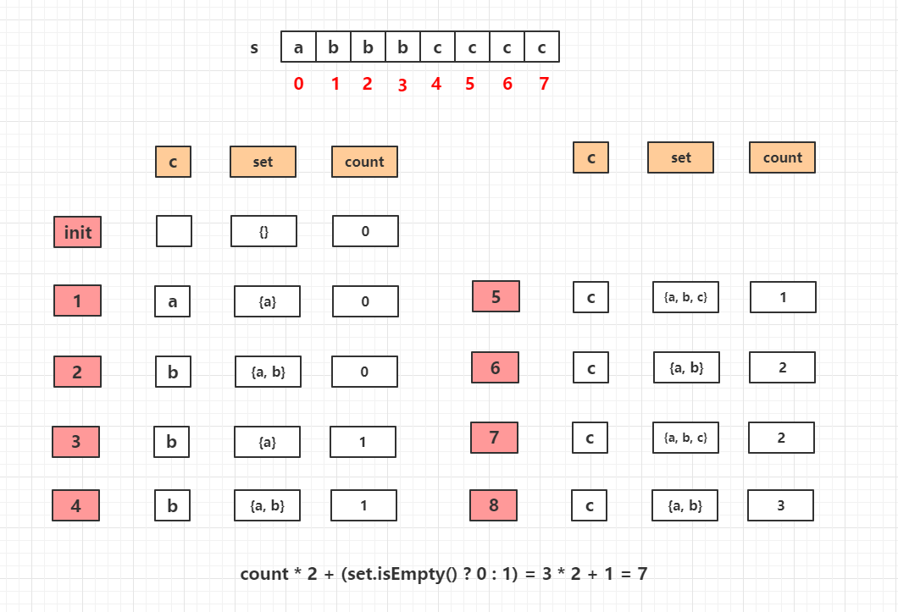

## Algorithm

[409. Longest Palindrome](https://leetcode.com/problems/longest-palindrome/)

### Description

Given a string s which consists of lowercase or uppercase letters, return the length of the longest palindrome that can be built with those letters.

Letters are case sensitive, for example, "Aa" is not considered a palindrome here.

Example 1:

```
Input: s = "abccccdd"
Output: 7
Explanation:
One longest palindrome that can be built is "dccaccd", whose length is 7.
```

Example 2:

```
Input: s = "a"
Output: 1
```

Example 3:

```
Input: s = "bb"
Output: 2
```

Constraints:

- 1 <= s.length <= 2000
- s consists of lowercase and/or uppercase English letters only.

### Solution

```java
class Solution {
    public int longestPalindrome(String s) {
        if(s==null || s.length()==0) return 0;
        HashSet<Character> hs = new HashSet<Character>();
        int count = 0;
        for(int i=0; i<s.length(); i++){
            if(hs.contains(s.charAt(i))){
                hs.remove(s.charAt(i));
                count++;
            }else{
                hs.add(s.charAt(i));
            }
        }
        if(!hs.isEmpty()) return count*2+1;
        return count*2;
    }
}
```

### Discuss



## Review

也就是求一个字符串可以构成的回文形式的字符串长度最长可以是多少。

只要某一个字符出现的次数为偶数次，则一定可以在回文串中的，而回文串中也可以有一个其他的字母。
因此题目只需要统计一个字符串中出现的奇数次的字母的个数即可。

## Tip


## Share
