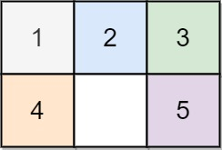
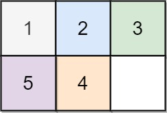
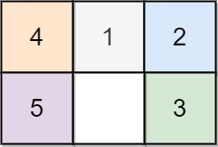

## Algorithm

[773. Sliding Puzzle](https://leetcode.com/problems/sliding-puzzle/)

### Description

On an 2 x 3 board, there are five tiles labeled from 1 to 5, and an empty square represented by 0. A move consists of choosing 0 and a 4-directionally adjacent number and swapping it.

The state of the board is solved if and only if the board is [[1,2,3],[4,5,0]].

Given the puzzle board board, return the least number of moves required so that the state of the board is solved. If it is impossible for the state of the board to be solved, return -1.

Example 1:



```
Input: board = [[1,2,3],[4,0,5]]
Output: 1
Explanation: Swap the 0 and the 5 in one move.
```

Example 2:



```
Input: board = [[1,2,3],[5,4,0]]
Output: -1
Explanation: No number of moves will make the board solved.
```

Example 3:



```
Input: board = [[4,1,2],[5,0,3]]
Output: 5
Explanation: 5 is the smallest number of moves that solves the board.
An example path:
After move 0: [[4,1,2],[5,0,3]]
After move 1: [[4,1,2],[0,5,3]]
After move 2: [[0,1,2],[4,5,3]]
After move 3: [[1,0,2],[4,5,3]]
After move 4: [[1,2,0],[4,5,3]]
After move 5: [[1,2,3],[4,5,0]]
```

Constraints:

- board.length == 2
- board[i].length == 3
- 0 <= board[i][j] <= 5
- Each value board[i][j] is unique.

### Solution

```java
class Solution {
    public int slidingPuzzle(int[][] board) {
        String target = "123450";
        String start = "";
        for (int i = 0; i < board.length; i++) {
            for (int j = 0; j < board[0].length; j++) {
                start += board[i][j];
            }
        }
        HashSet<String> visited = new HashSet<>();
        // all the positions 0 can be swapped to
        int[][] dirs = new int[][] { { 1, 3 }, { 0, 2, 4 },
                { 1, 5 }, { 0, 4 }, { 1, 3, 5 }, { 2, 4 } };
        Queue<String> queue = new LinkedList<>();
        queue.offer(start);
        visited.add(start);
        int res = 0;
        while (!queue.isEmpty()) {
            // level count, has to use size control here, otherwise not needed
            int size = queue.size();
            for (int i = 0; i < size; i++) {
                String cur = queue.poll();
                if (cur.equals(target)) {
                    return res;
                }
                int zero = cur.indexOf('0');
                // swap if possible
                for (int dir : dirs[zero]) {
                    String next = swap(cur, zero, dir);
                    if (visited.contains(next)) {
                        continue;
                    }
                    visited.add(next);
                    queue.offer(next);

                }
            }
            res++;
        }
        return -1;
    }

    private String swap(String str, int i, int j) {
        StringBuilder sb = new StringBuilder(str);
        sb.setCharAt(i, str.charAt(j));
        sb.setCharAt(j, str.charAt(i));
        return sb.toString();
    }
}
```

### Discuss

## Review


## Tip


## Share
