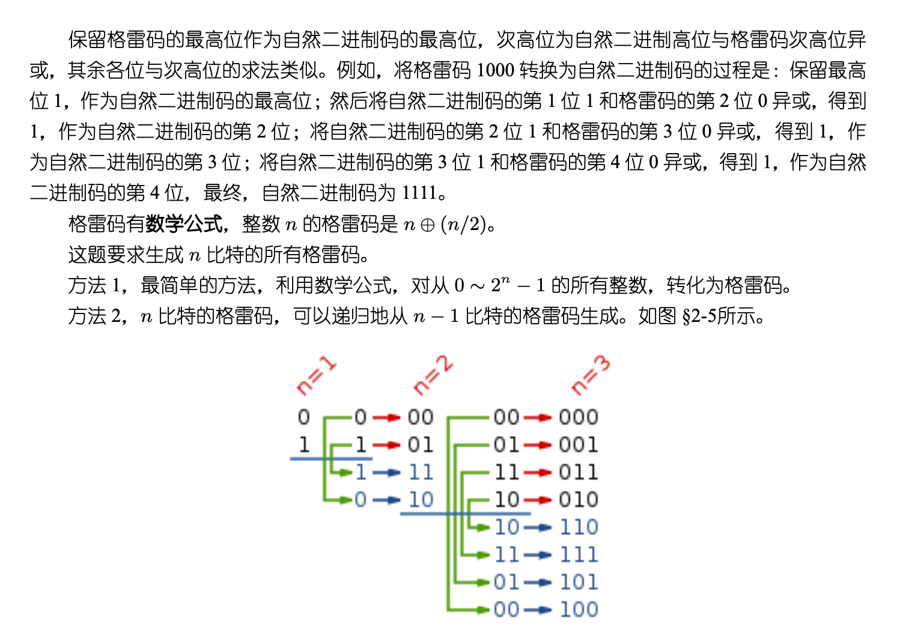

## Algorithm

[89. Gray Code](https://leetcode.com/problems/gray-code/)

### Description

An n-bit gray code sequence is a sequence of 2n integers where:

Every integer is in the inclusive range [0, 2n - 1],
The first integer is 0,
An integer appears no more than once in the sequence,
The binary representation of every pair of adjacent integers differs by exactly one bit, and
The binary representation of the first and last integers differs by exactly one bit.
Given an integer n, return any valid n-bit gray code sequence.


Example 1:

```
Input: n = 2
Output: [0,1,3,2]
Explanation:
The binary representation of [0,1,3,2] is [00,01,11,10].
- 00 and 01 differ by one bit
- 01 and 11 differ by one bit
- 11 and 10 differ by one bit
- 10 and 00 differ by one bit
[0,2,3,1] is also a valid gray code sequence, whose binary representation is [00,10,11,01].
- 00 and 10 differ by one bit
- 10 and 11 differ by one bit
- 11 and 01 differ by one bit
- 01 and 00 differ by one bit
```

Example 2:

```
Input: n = 1
Output: [0,1]
```

Constraints:

- 1 <= n <= 16

### Solution

```java
class Solution {
    public List<Integer> grayCode(int n) {
        Integer[] r = new Integer[1<<n];
        r[0] = 0;
        int N = 1;
        for(int iN = 0; iN < n; iN++) {
            for(int i = N - 1, pos = N; i >= 0; i--, pos++) {
                r[pos] = N | r[i];
            }
            N <<= 1;
        }
        return Arrays.asList(r);
    }
}
```

### Discuss




## Review


## Tip


## Share
