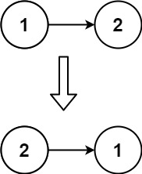

## Algorithm

[206. Reverse Linked List](https://leetcode.com/problems/reverse-linked-list/)

### Description

Given the head of a singly linked list, reverse the list, and return the reversed list.

Example 1:


```
Input: head = [1,2,3,4,5]
Output: [5,4,3,2,1]
```

Example 2:



```
Input: head = [1,2]
Output: [2,1]
```

Example 3:

```
Input: head = []
Output: []
```

Constraints:

- The number of nodes in the list is the range [0, 5000].
- -5000 <= Node.val <= 5000


Follow up: A linked list can be reversed either iteratively or recursively. Could you implement both?

### Solution

```java
/**
 * Definition for singly-linked list.
 * public class ListNode {
 *     int val;
 *     ListNode next;
 *     ListNode() {}
 *     ListNode(int val) { this.val = val; }
 *     ListNode(int val, ListNode next) { this.val = val; this.next = next; }
 * }
 */
class Solution {
    public ListNode reverseList(ListNode head){
        if(head == null || head.next ==null){
            return head;
        }
        ListNode pre = null;
        ListNode now = head;
        while(now!=null){
            ListNode next = now.next;
            now.next =pre;
            pre = now;
            now = next;
        }
        return pre;
    }
}
```

### Discuss

## Review


## Tip


## Share
