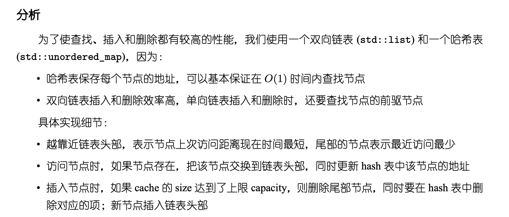

## Algorithm

[146. LRU Cache](https://leetcode.com/problems/lru-cache/)

### Description

Design a data structure that follows the constraints of a Least Recently Used (LRU) cache.

Implement the LRUCache class:

- LRUCache(int capacity) Initialize the LRU cache with positive size capacity.
- int get(int key) Return the value of the key if the key exists, otherwise return -1.
- void put(int key, int value) Update the value of the key if the key exists. Otherwise, add the key-value pair to the cache. If the number of keys exceeds the capacity from this operation, evict the least recently used key.

The functions get and put must each run in O(1) average time complexity.


Example 1:

```
Input
["LRUCache", "put", "put", "get", "put", "get", "put", "get", "get", "get"]
[[2], [1, 1], [2, 2], [1], [3, 3], [2], [4, 4], [1], [3], [4]]
Output
[null, null, null, 1, null, -1, null, -1, 3, 4]

Explanation
LRUCache lRUCache = new LRUCache(2);
lRUCache.put(1, 1); // cache is {1=1}
lRUCache.put(2, 2); // cache is {1=1, 2=2}
lRUCache.get(1);    // return 1
lRUCache.put(3, 3); // LRU key was 2, evicts key 2, cache is {1=1, 3=3}
lRUCache.get(2);    // returns -1 (not found)
lRUCache.put(4, 4); // LRU key was 1, evicts key 1, cache is {4=4, 3=3}
lRUCache.get(1);    // return -1 (not found)
lRUCache.get(3);    // return 3
lRUCache.get(4);    // return 4
```

Constraints:

- 1 <= capacity <= 3000
- 0 <= key <= 104
- 0 <= value <= 105
- At most 2 * 105 calls will be made to get and put.

### Solution

```java
import java.util.Hashtable;
class LRUCache {

    // 定义一个内部类，存储LRU节点
    class DLinkedNode {
      // key
      int key;
      // value
      int value;
      // 前一个节点
      DLinkedNode pre;
      // 后一个节点
      DLinkedNode post;
    }

    /**
     * Always add the new node right after head;
     */
    private void addNode(DLinkedNode node) {
       node.pre = head;
       node.post = head.post;
       head.post.pre = node;
       head.post = node;
    }

    /**
     * Remove an existing node from the linked list.
     */
    private void removeNode(DLinkedNode node){
       DLinkedNode pre = node.pre;
       DLinkedNode post = node.post;
       pre.post = post;
       post.pre = pre;
    }

    /**
     * Move certain node in between to the head.
     */
    private void moveToHead(DLinkedNode node){
      this.removeNode(node);
      this.addNode(node);
    }

    // pop the current tail.
    private DLinkedNode popTail(){
       DLinkedNode res = tail.pre;
       this.removeNode(res);
       return res;
    }

    private Hashtable<Integer, DLinkedNode> cache = new Hashtable<Integer, DLinkedNode>();
    private int count;
    private int capacity;
    private DLinkedNode head, tail;

    public LRUCache(int capacity) {
        this.count = 0;
        this.capacity = capacity;

        head = new DLinkedNode();
        head.pre = null;

        tail = new DLinkedNode();
        tail.post = null;

        head.post = tail;
        tail.pre = head;
    }

    public int get(int key) {
        DLinkedNode node = cache.get(key);
        if(node == null){
            // should raise exception here.
            return -1;
        }
        // move the accessed node to the head;
        this.moveToHead(node);
        return node.value;
    }

    public void put(int key, int value) {
        DLinkedNode node = cache.get(key);
        if(node == null){
          DLinkedNode newNode = new DLinkedNode();
          newNode.key = key;
          newNode.value = value;
          this.cache.put(key, newNode);
          this.addNode(newNode);
          ++count;

          if(count > capacity){
            // pop the tail
            DLinkedNode tail = this.popTail();
            this.cache.remove(tail.key);
            --count;
          }
       }else{
          // update the value.
          node.value = value;
          this.moveToHead(node);
       }
    }
}

/**
 * Your LRUCache object will be instantiated and called as such:
 * LRUCache obj = new LRUCache(capacity);
 * int param_1 = obj.get(key);
 * obj.put(key,value);
 */
```

### Discuss



## Review


## Tip


## Share
