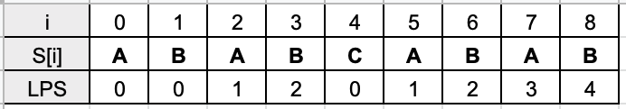
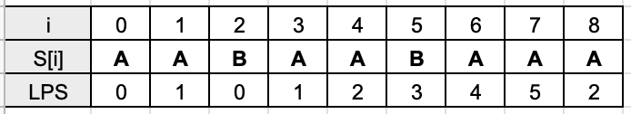

## Algorithm

[28. Implement strStr()](https://leetcode.com/problems/implement-strstr/)

### Description

Implement strStr().

Given two strings needle and haystack, return the index of the first occurrence of needle in haystack, or -1 if needle is not part of haystack.

Clarification:

What should we return when needle is an empty string? This is a great question to ask during an interview.

For the purpose of this problem, we will return 0 when needle is an empty string. This is consistent to C's strstr() and Java's indexOf().


Example 1:

```
Input: haystack = "hello", needle = "ll"
Output: 2
```


Example 2:

```
Input: haystack = "aaaaa", needle = "bba"
Output: -1
```

Constraints:

- 1 <= haystack.length, needle.length <= 104
- haystack and needle consist of only lowercase English characters.

### Solution

```java
class Solution {
    public int strStr(String haystack, String needle) {
        for(int i=0;;i++){
            for(int j=0;;j++){
                if(j==needle.length()){
                    return i;
                }
                if(i+j==haystack.length()){
                    return -1;
                }
                if(haystack.charAt(i+j)!=needle.charAt(j)){
                     break;
                }
            }
        }
    }
}
```

KMP

Compute KMP Table: LPS which is Longest Prefix also Suffix

Example 1:



Example 2:



```Java
class Solution {
    public int strStr(String haystack, String needle) {
        if (needle.isEmpty()) return 0;
        int[] lps = computeKMPTable(needle);
        int i = 0, j = 0, n = haystack.length(), m = needle.length();
        while (i < n) {
            if (haystack.charAt(i) == needle.charAt(j)) {
                ++i; ++j;
                if (j == m) return i - m; // found solution
            } else {
                if (j != 0) j = lps[j - 1]; // try match with longest prefix suffix
                else i++; // don't match -> go to next character of `haystack` string
            }
        }
        return -1;
    }
    private int[] computeKMPTable(String pattern) {
        int i = 1, j = 0, n = pattern.length();
        int[] lps = new int[n];
        while (i < n) {
            if (pattern.charAt(i) == pattern.charAt(j)) {
                lps[i++] = ++j;
            } else {
                if (j != 0) j = lps[j - 1]; // try match with longest prefix suffix
                else i++; // don't match -> go to next character
            }
        }
        return lps;
    }
}
```

### Discuss

## Review


## Tip


## Share
