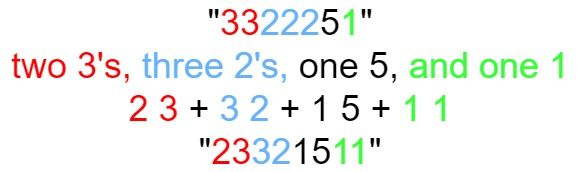

## Algorithm

[38. Count and Say](https://leetcode.com/problems/count-and-say/)

### Description

The count-and-say sequence is a sequence of digit strings defined by the recursive formula:

countAndSay(1) = "1"
countAndSay(n) is the way you would "say" the digit string from countAndSay(n-1), which is then converted into a different digit string.
To determine how you "say" a digit string, split it into the minimal number of substrings such that each substring contains exactly one unique digit. Then for each substring, say the number of digits, then say the digit. Finally, concatenate every said digit.

For example, the saying and conversion for digit string "3322251":



Given a positive integer n, return the nth term of the count-and-say sequence.


Example 1:

```
Input: n = 1
Output: "1"
Explanation: This is the base case.
```

Example 2:

```
Input: n = 4
Output: "1211"
Explanation:
countAndSay(1) = "1"
countAndSay(2) = say "1" = one 1 = "11"
countAndSay(3) = say "11" = two 1's = "21"
countAndSay(4) = say "21" = one 2 + one 1 = "12" + "11" = "1211"
```

Constraints:

- 1 <= n <= 30

### Solution

```java
class Solution {
    public String countAndSay(int n) {
        String res = "1";
        for(int i=1;i<n;i++){
            char[] c = res.toCharArray();
            res="";
            int count = 1;
            for(int j=0;j<c.length-1;j++){
                if(c[j]==c[j+1]){
                   count++;
                }else{
                   res+=(""+count+c[j]);
                   count=1;
                }
            }
            res+=(""+count+c[c.length-1]);
        }
        return res;
    }
}
```

### Discuss

## Review


## Tip


## Share
