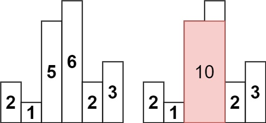
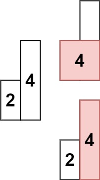

## Algorithm

[84. Largest Rectangle in Histogram](https://leetcode.com/problems/largest-rectangle-in-histogram/)

### Description

Given an array of integers heights representing the histogram's bar height where the width of each bar is 1, return the area of the largest rectangle in the histogram.


Example 1:



```
Input: heights = [2,1,5,6,2,3]
Output: 10
Explanation: The above is a histogram where width of each bar is 1.
The largest rectangle is shown in the red area, which has an area = 10 units.
```

Example 2:



```
Input: heights = [2,4]
Output: 4
```

Constraints:

- 1 <= heights.length <= 105
- 0 <= heights[i] <= 104

### Solution

```java
class Solution {
    public int largestRectangleArea(int[] heights) {
        int size = heights.length;
        Stack<Integer> stack = new Stack<>();
        stack.push(-1);
        int max = 0;
        for (int i = 0; i < size; ++i){
            while (stack.peek() != -1 && heights[i] < heights[stack.peek()]){
                int h = heights[stack.pop()];
                int w = i - stack.peek() - 1;
                max = Math.max(max, w * h);
            }
            stack.push(i);
        }

        while (stack.peek() != -1){
            int h = heights[stack.pop()];
            int w = size - stack.peek() - 1;
            max = Math.max(max, w * h);
        }
        return max;
    }
}
```

### Discuss

## Review


## Tip


## Share
