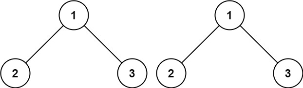
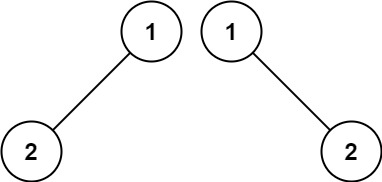
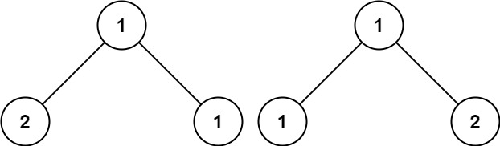

## Algorithm

[100. Same Tree](https://leetcode.com/problems/same-tree/)

### Description

Given the roots of two binary trees p and q, write a function to check if they are the same or not.

Two binary trees are considered the same if they are structurally identical, and the nodes have the same value.


Example 1:



```
Input: p = [1,2,3], q = [1,2,3]
Output: true
```


Example 2:



```
Input: p = [1,2], q = [1,null,2]
Output: false
```

Example 3:



```
Input: p = [1,2,1], q = [1,1,2]
Output: false
```

Constraints:

- The number of nodes in both trees is in the range [0, 100].
- -104 <= Node.val <= 104

### Solution

```java
/**
 * Definition for a binary tree node.
 * public class TreeNode {
 *     int val;
 *     TreeNode left;
 *     TreeNode right;
 *     TreeNode(int x) { val = x; }
 * }
 */
class Solution {
    public boolean isSameTree(TreeNode p, TreeNode q) {
        if(p==null&&q!=null||p!=null&&q==null) return false;
        if(p==null&&q==null) return true;
        if(p.val!=q.val) return false;
        return isSameTree(p.left,q.left)&&isSameTree(p.right,q.right);
    }
}
```

### Discuss

## Review


## Tip


## Share
