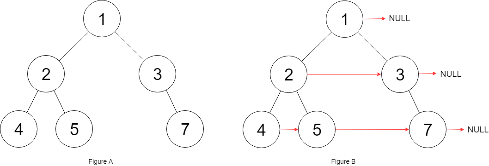

## Algorithm

[117. Populating Next Right Pointers in Each Node II](https://leetcode.com/problems/populating-next-right-pointers-in-each-node-ii/)

### Description

Given a binary tree

```
struct Node {
  int val;
  Node *left;
  Node *right;
  Node *next;
}
```

Populate each next pointer to point to its next right node. If there is no next right node, the next pointer should be set to NULL.

Initially, all next pointers are set to NULL.


Example 1:




```
Input: root = [1,2,3,4,5,null,7]
Output: [1,#,2,3,#,4,5,7,#]
Explanation: Given the above binary tree (Figure A), your function should populate each next pointer to point to its next right node, just like in Figure B. The serialized output is in level order as connected by the next pointers, with '#' signifying the end of each level.
```

Example 2:

```
Input: root = []
Output: []
```

Constraints:

- The number of nodes in the tree is in the range [0, 6000].
- -100 <= Node.val <= 100


Follow-up:

- You may only use constant extra space.
- The recursive approach is fine. You may assume implicit stack space does not count as extra space for this problem.

### Solution

```java
/*
// Definition for a Node.
class Node {
    public int val;
    public Node left;
    public Node right;
    public Node next;

    public Node() {}

    public Node(int _val) {
        val = _val;
    }

    public Node(int _val, Node _left, Node _right, Node _next) {
        val = _val;
        left = _left;
        right = _right;
        next = _next;
    }
};
*/

class Solution {
    public Node connect(Node root) {
      Node dummyHead  = new Node(0); // this head will always point to the first element in the current layer we are searching
      Node pre = dummyHead; // this 'pre' will be the "current node" that builds every single layer   
      Node realRoot = root; // just for return statement

      while(root != null){
          if(root.left != null){
              pre.next = root.left;
              pre = pre.next;
          }
          if(root.right != null){
              pre.next = root.right;
              pre = pre.next;
          }
          root = root.next;
          if(root == null){ // reach the end of current layer
              pre = dummyHead; // shift pre back to the beginning, get ready to point to the first element in next layer  
              root = dummyHead.next; ;//root comes down one level below to the first available non null node
              dummyHead.next = null;//reset dummyhead back to default null
          }
      }
      return realRoot;
    }
}
```

### Discuss

## Review


## Tip


## Share
