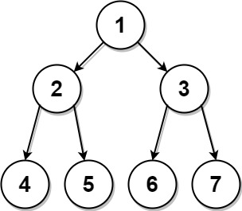

## Algorithm

[889. Construct Binary Tree from Preorder and Postorder Traversal](https://leetcode.com/problems/construct-binary-tree-from-preorder-and-postorder-traversal/)

### Description

Given two integer arrays, preorder and postorder where preorder is the preorder traversal of a binary tree of distinct values and postorder is the postorder traversal of the same tree, reconstruct and return the binary tree.

If there exist multiple answers, you can return any of them.


Example 1:



```
Input: preorder = [1,2,4,5,3,6,7], postorder = [4,5,2,6,7,3,1]
Output: [1,2,3,4,5,6,7]
```

Example 2:

```
Input: preorder = [1], postorder = [1]
Output: [1]
```

Constraints:

- 1 <= preorder.length <= 30
- 1 <= preorder[i] <= preorder.length
- All the values of preorder are unique.
- postorder.length == preorder.length
- 1 <= postorder[i] <= postorder.length
- All the values of postorder are unique.
- It is guaranteed that preorder and postorder are the preorder traversal and postorder traversal of the same binary tree.

### Solution

```java
/**
 * Definition for a binary tree node.
 * public class TreeNode {
 *     int val;
 *     TreeNode left;
 *     TreeNode right;
 *     TreeNode() {}
 *     TreeNode(int val) { this.val = val; }
 *     TreeNode(int val, TreeNode left, TreeNode right) {
 *         this.val = val;
 *         this.left = left;
 *         this.right = right;
 *     }
 * }
 */
class Solution {
    public TreeNode constructFromPrePost(int[] pre, int[] post) {
        return dfs(pre, 0, pre.length - 1, post, 0, pre.length - 1);
    }
    private TreeNode dfs(int[] pre, int preStart, int preEnd, int[] post, int postStart, int postEnd){
        if(preStart > preEnd){
            return null;
        }
        TreeNode root = new TreeNode(pre[preStart]);
        if (preStart == preEnd) {
            return root;
        }
        int postIndex = postStart;
        while(post[postIndex] != pre[preStart + 1]){
            postIndex++;
        }
        int len = postIndex - postStart + 1;
        root.left = dfs(pre, preStart+1,preStart+len, post,postStart,postStart+len);
        root.right = dfs(pre, preStart+len+1,preEnd, post,postStart+len, postEnd - 1);
        return root;
    }
}
```

### Discuss

## Review


## Tip


## Share
