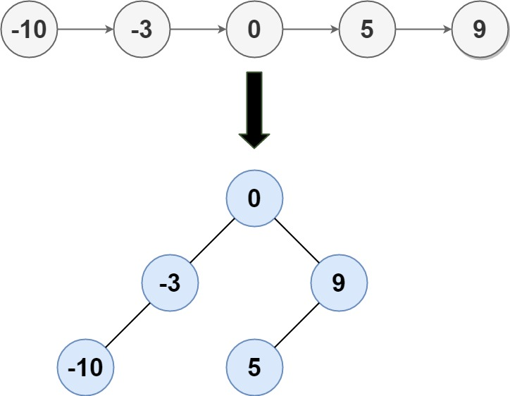

## Algorithm

[109. Convert Sorted List to Binary Search Tree](https://leetcode.com/problems/convert-sorted-list-to-binary-search-tree/)

### Description

Given the head of a singly linked list where elements are sorted in ascending order, convert it to a height balanced BST.

For this problem, a height-balanced binary tree is defined as a binary tree in which the depth of the two subtrees of every node never differ by more than 1.


Example 1:



```
Input: head = [-10,-3,0,5,9]
Output: [0,-3,9,-10,null,5]
Explanation: One possible answer is [0,-3,9,-10,null,5], which represents the shown height balanced BST.
```

Example 2:

```
Input: head = []
Output: []
```

Constraints:

- The number of nodes in head is in the range [0, 2 * 104].
- -105 <= Node.val <= 105

### Solution

```java
/**
 * Definition for singly-linked list.
 * public class ListNode {
 *     int val;
 *     ListNode next;
 *     ListNode(int x) { val = x; }
 * }
 */
/**
 * Definition for a binary tree node.
 * public class TreeNode {
 *     int val;
 *     TreeNode left;
 *     TreeNode right;
 *     TreeNode(int x) { val = x; }
 * }
 */
class Solution {
    public TreeNode sortedListToBST(ListNode head) {
        if(head==null) {
            return null;
        }
        return toBST(head,null);
    }
    public TreeNode toBST(ListNode head, ListNode tail){
        ListNode slow = head;
        ListNode fast = head;
        if(head==tail){
            return null;
        }
        while(fast!=tail&&fast.next!=tail){
            fast = fast.next.next;
            slow = slow.next;
        }
        TreeNode root = new TreeNode(slow.val);
        root.left = toBST(head, slow);
        root.right = toBST(slow.next, tail);
        return root;
    }
}
```

### Discuss

## Review


## Tip


## Share
