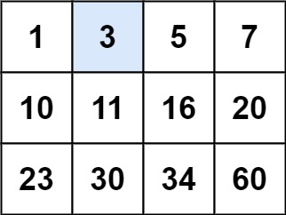
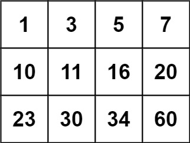

## Algorithm

[74. Search a 2D Matrix](https://leetcode.com/problems/search-a-2d-matrix)

### Description

Write an efficient algorithm that searches for a value target in an m x n integer matrix matrix. This matrix has the following properties:

Integers in each row are sorted from left to right.
The first integer of each row is greater than the last integer of the previous row.


Example 1:



```
Input: matrix = [[1,3,5,7],[10,11,16,20],[23,30,34,60]], target = 3
Output: true
```

Example 2:



```
Input: matrix = [[1,3,5,7],[10,11,16,20],[23,30,34,60]], target = 13
Output: false
```

Constraints:

- m == matrix.length
- n == matrix[i].length
- 1 <= m, n <= 100
- -104 <= matrix[i][j], target <= 104

### Solution

```java
class Solution {
    public boolean searchMatrix(int[][] matrix, int target) {
        int i = 0;
        int j = matrix[0].length-1;
        while(i>=0 && i<matrix.length && j>=0 && j<matrix[0].length){
            if(matrix[i][j] == target){
                return true;
            }else if(matrix[i][j] < target){
                i++;
            }else if(matrix[i][j] > target){
                j--;
            }
        }
        return false;
    }
}
```

### Discuss

## Review


## Tip


## Share
