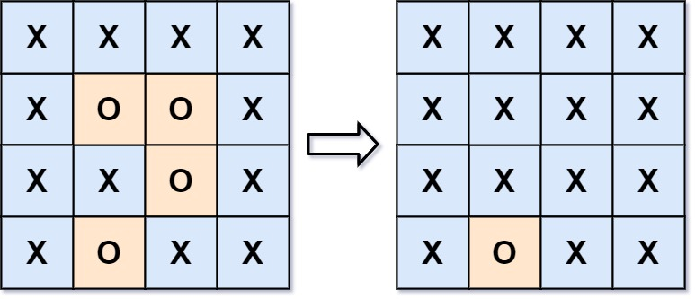

## Algorithm

[130. Surrounded Regions](https://leetcode.com/problems/surrounded-regions/)

### Description

Given an m x n matrix board containing 'X' and 'O', capture all regions that are 4-directionally surrounded by 'X'.

A region is captured by flipping all 'O's into 'X's in that surrounded region.


Example 1:



```
Input: board = [["X","X","X","X"],["X","O","O","X"],["X","X","O","X"],["X","O","X","X"]]
Output: [["X","X","X","X"],["X","X","X","X"],["X","X","X","X"],["X","O","X","X"]]
Explanation: Notice that an 'O' should not be flipped if:
- It is on the border, or
- It is adjacent to an 'O' that should not be flipped.
The bottom 'O' is on the border, so it is not flipped.
The other three 'O' form a surrounded region, so they are flipped.
```

Example 2:

```
Input: board = [["X"]]
Output: [["X"]]
```

Constraints:

- m == board.length
- n == board[i].length
- 1 <= m, n <= 200
- board[i][j] is 'X' or 'O'.

### Solution

```java
class Solution {
    public void solve(char[][] board) {
        int m = board.length;
        int n = board[0].length;
        int[][] dirs = new int[][]{{0, 1}, {0, -1}, {1, 0}, {-1, 0}};
        Queue<int[]> queue = new LinkedList<>();
        for (int i = 0; i < m; i++) {
            if (board[i][0] == 'O') {
                queue.add(new int[] {i, 0});
            }
            if (board[i][n - 1] == 'O') {
                queue.add(new int[] {i, n - 1});
            }
        }
        for (int j = 1; j < n - 1; j++) {
            if (board[0][j] == 'O') {
                queue.add(new int[] {0, j});
            }
            if (board[m - 1][j] == 'O') {
                queue.add(new int[] {m - 1, j});
            }
        }
        while(!queue.isEmpty()) {
            int[] curr = queue.poll();
            board[curr[0]][curr[1]] = '1';
            for (int[] dir : dirs) {
                if (curr[0] + dir[0] > 0 &&
                    curr[0] + dir[0] < m &&
                    curr[1] + dir[1] > 0 &&
                    curr[1] + dir[1] < n &&
                    board[curr[0] + dir[0]][curr[1] + dir[1]] == 'O') {
                    board[curr[0] + dir[0]][curr[1] + dir[1]] = '1';
                    queue.add(new int[]{curr[0] + dir[0], curr[1] + dir[1]});
                }
            }
        }
        for (int i = 0; i < m; i++) {
            for (int j = 0; j < n; j++) {
                if (board[i][j] == '1') {
                    board[i][j] = 'O';
                } else {
                    board[i][j] = 'X';
                }
            }
        }

    }
}
```

### Discuss

## Review


## Tip


## Share
