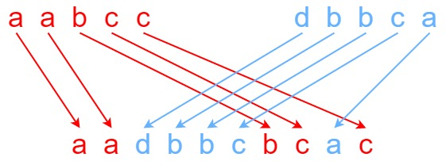

## Algorithm

[97. Interleaving String](https://leetcode.com/problems/interleaving-string/)

### Description

Given strings s1, s2, and s3, find whether s3 is formed by an interleaving of s1 and s2.

An interleaving of two strings s and t is a configuration where s and t are divided into n and m non-empty substrings respectively, such that:

- s = s1 + s2 + ... + sn
- t = t1 + t2 + ... + tm
- |n - m| <= 1
- The interleaving is s1 + t1 + s2 + t2 + s3 + t3 + ... or t1 + s1 + t2 + s2 + t3 + s3 + ...

Note: a + b is the concatenation of strings a and b.


Example 1:



```
Input: s1 = "aabcc", s2 = "dbbca", s3 = "aadbbcbcac"
Output: true
Explanation: One way to obtain s3 is:
Split s1 into s1 = "aa" + "bc" + "c", and s2 into s2 = "dbbc" + "a".
Interleaving the two splits, we get "aa" + "dbbc" + "bc" + "a" + "c" = "aadbbcbcac".
Since s3 can be obtained by interleaving s1 and s2, we return true.
```

Example 2:

```
Input: s1 = "aabcc", s2 = "dbbca", s3 = "aadbbbaccc"
Output: false
Explanation: Notice how it is impossible to interleave s2 with any other string to obtain s3.
```

Example 3:

```
Input: s1 = "", s2 = "", s3 = ""
Output: true
```

Constraints:

- 0 <= s1.length, s2.length <= 100
- 0 <= s3.length <= 200
- s1, s2, and s3 consist of lowercase English letters.


Follow up: Could you solve it using only O(s2.length) additional memory space?

### Solution

```java
class Solution {
    public boolean isInterleave(String s1, String s2, String s3) {
        int len1 = s1.length();
    	int len2 = s2.length();
    	int len3 = s3.length();

    	if(len1 + len2 != len3){
    		return false;
    	}

    	boolean[][] f = new boolean[len1+1][len2+1];
    	f[0][0] = true;//第一个设置为true
    	for(int i = 0; i <= len1; i++){
    		for(int j = 0; j <= len2; j++){
    			//i>0,j>0的条件是去掉i=0j=0的值
    			if(j > 0){
    				f[i][j] = f[i][j-1]&&(s3.charAt(i+j-1) == s2.charAt(j-1));
    			}
    			if(i > 0){
    				f[i][j] = f[i][j] || ( f[i-1][j]&&(s3.charAt(i+j-1) == s1.charAt(i-1)));
    			}
    		}
    	}
    	return f[len1][len2];
    }
}
```

### Discuss

## Review


## Tip


## Share
