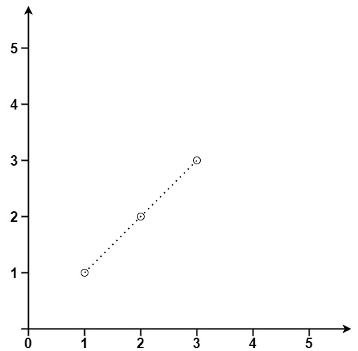
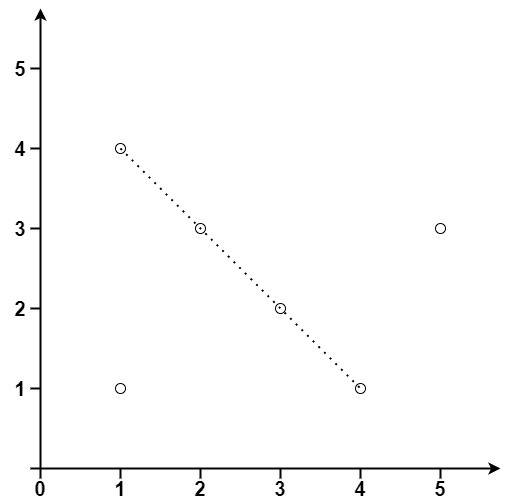

## Algorithm

[149. Max Points on a Line](https://leetcode.com/problems/max-points-on-a-line/)

### Description

Given an array of points where points[i] = [xi, yi] represents a point on the X-Y plane, return the maximum number of points that lie on the same straight line.


Example 1:



```
Input: points = [[1,1],[2,2],[3,3]]
Output: 3
```

Example 2:



```
Input: points = [[1,1],[3,2],[5,3],[4,1],[2,3],[1,4]]
Output: 4
```

Constraints:

- 1 <= points.length <= 300
- points[i].length == 2
- -104 <= xi, yi <= 104
- All the points are unique.

### Solution

```java
class Solution {
    public int maxPoints(int[][] points) {
        if(points.length <= 0) return 0;
        if(points.length <= 2) return points.length;
        int result = 0;
        for(int i = 0; i < points.length; i++){
            HashMap<Double, Integer> hm = new HashMap<Double, Integer>();
            int samex = 1;
            int samep = 0;
            for(int j = 0; j < points.length; j++){
                if(j != i){
                    if((points[j].x == points[i].x) && (points[j].y == points[i].y)){
                        samep++;
                    }
                    if(points[j].x == points[i].x){
                        samex++;
                        continue;
                    }
                    double k = (double)(points[j].y - points[i].y) / (double)(points[j].x - points[i].x);
                    if(hm.containsKey(k)){
                        hm.put(k,hm.get(k) + 1);
                    }else{
                        hm.put(k, 2);
                    }
                    result = Math.max(result, hm.get(k) + samep);
                }
            }
            result = Math.max(result, samex);
        }
        return result;
    }
}
```

### Discuss

## Review


## Tip


## Share
