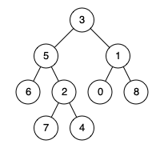

## Algorithm

[236. Lowest Common Ancestor of a Binary Tree](https://leetcode.com/problems/lowest-common-ancestor-of-a-binary-tree/)

### Description

Given a binary tree, find the lowest common ancestor (LCA) of two given nodes in the tree.

According to the definition of LCA on Wikipedia: “The lowest common ancestor is defined between two nodes p and q as the lowest node in T that has both p and q as descendants (where we allow a node to be a descendant of itself).”

Example 1:



```
Input: root = [3,5,1,6,2,0,8,null,null,7,4], p = 5, q = 1
Output: 3
Explanation: The LCA of nodes 5 and 1 is 3.
```

Example 2:


```
Input: root = [3,5,1,6,2,0,8,null,null,7,4], p = 5, q = 4
Output: 5
Explanation: The LCA of nodes 5 and 4 is 5, since a node can be a descendant of itself according to the LCA definition.
```

Example 3:

```
Input: root = [1,2], p = 1, q = 2
Output: 1
```

Constraints:

- The number of nodes in the tree is in the range [2, 105].
- -109 <= Node.val <= 109
- All Node.val are unique.
- p != q
- p and q will exist in the tree.

### Solution

```java
/**
 * Definition for a binary tree node.
 * public class TreeNode {
 *     int val;
 *     TreeNode left;
 *     TreeNode right;
 *     TreeNode(int x) { val = x; }
 * }
 */
class Solution {
    public TreeNode lowestCommonAncestor(TreeNode root, TreeNode p, TreeNode q) {
        if(root == null){
            return null;
        }
        if(root.val==p.val || root.val==q.val){
            return root;
        }
        TreeNode lca1 = lowestCommonAncestor(root.left, p, q);
        TreeNode lca2 = lowestCommonAncestor(root.right, p, q);
        if(lca1!=null && lca2!=null){
            return root;
        }
        if(lca1 !=null){
            return lca1;
        }else{
            return lca2;
        }
    }
}
```

### Discuss

## Review


## Tip


## Share
