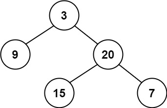
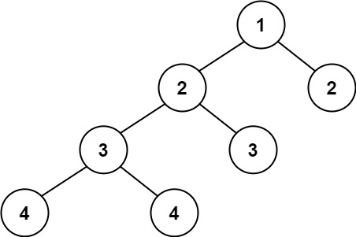

## Algorithm

[110. Balanced Binary Tree](https://leetcode.com/problems/balanced-binary-tree/)

### Description

Given a binary tree, determine if it is height-balanced.

Example 1:



```
Input: root = [3,9,20,null,null,15,7]
Output: true
```


Example 2:



```
Input: root = [1,2,2,3,3,null,null,4,4]
Output: false
```

Example 3:

```
Input: root = []
Output: true
```

Constraints:

- The number of nodes in the tree is in the range [0, 5000].
- -104 <= Node.val <= 104

### Solution

```java
/**
 * Definition for a binary tree node.
 * public class TreeNode {
 *     int val;
 *     TreeNode left;
 *     TreeNode right;
 *     TreeNode(int x) { val = x; }
 * }
 */
class Solution {
    public boolean isBalanced(TreeNode root) {
        if(root==null){
            return true;
        }
        int left = depth(root.left);
        int right = depth(root.right);
        if(left-right>1 || right-left>1){
            return false;
        }
        return isBalanced(root.left)&&isBalanced(root.right);
    }

    public int depth(TreeNode root){
        if(root==null){
            return 0;
        }
        if(root.left==null&&root.right==null){
            return 1;
        }
        int left = depth(root.left);
        int right = depth(root.right);
        return left>right?left+1:right+1;
    }
}
```

### Discuss

## Review


## Tip


## Share
