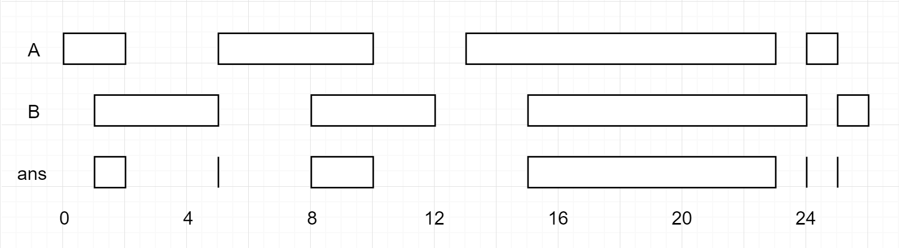

## Algorithm

[986. Interval List Intersections](https://leetcode.com/problems/interval-list-intersections/)

### Description

You are given two lists of closed intervals, firstList and secondList, where firstList[i] = [starti, endi] and secondList[j] = [startj, endj]. Each list of intervals is pairwise disjoint and in sorted order.

Return the intersection of these two interval lists.

A closed interval [a, b] (with a <= b) denotes the set of real numbers x with a <= x <= b.

The intersection of two closed intervals is a set of real numbers that are either empty or represented as a closed interval. For example, the intersection of [1, 3] and [2, 4] is [2, 3].

Example 1:



```
Input: firstList = [[0,2],[5,10],[13,23],[24,25]], secondList = [[1,5],[8,12],[15,24],[25,26]]
Output: [[1,2],[5,5],[8,10],[15,23],[24,24],[25,25]]
```

Example 2:

```
Input: firstList = [[1,3],[5,9]], secondList = []
Output: []
```

Constraints:

- 0 <= firstList.length, secondList.length <= 1000
- firstList.length + secondList.length >= 1
- 0 <= starti < endi <= 109
- endi < starti+1
- 0 <= startj < endj <= 109
- endj < startj+1

### Solution

```java
class Solution {
    public int[][] intervalIntersection(int[][] A, int[][] B) {
        List<int[]> res = new ArrayList();
        for (int i = 0, j = 0; i < A.length && j < B.length; ) {
            int start = Math.max(A[i][0], B[j][0]);
            int end = Math.min(A[i][1], B[j][1]);
            if (start <= end)
                res.add(new int[]{start, end});
            if (A[i][1] < B[j][1])
                ++i;
            else
                ++j;
        }
        return res.toArray(new int[0][]);
    }
}
```

### Discuss

## Review


## Tip


## Share
