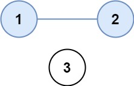
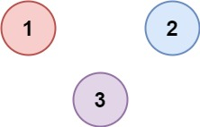

## Algorithm

[547. Number of Provinces](https://leetcode.com/problems/number-of-provinces/)

### Description

There are n cities. Some of them are connected, while some are not. If city a is connected directly with city b, and city b is connected directly with city c, then city a is connected indirectly with city c.

A province is a group of directly or indirectly connected cities and no other cities outside of the group.

You are given an n x n matrix isConnected where isConnected[i][j] = 1 if the ith city and the jth city are directly connected, and isConnected[i][j] = 0 otherwise.

Return the total number of provinces.

Example 1:



```
Input: isConnected = [[1,1,0],[1,1,0],[0,0,1]]
Output: 2
```

Example 2:



```
Input: isConnected = [[1,0,0],[0,1,0],[0,0,1]]
Output: 3
```

Constraints:

- 1 <= n <= 200
- n == isConnected.length
- n == isConnected[i].length
- isConnected[i][j] is 1 or 0.
- isConnected[i][i] == 1
- isConnected[i][j] == isConnected[j][i]

### Solution

```java
class Solution {
    public int findCircleNum(int[][] isConnected) {
        int n=isConnected.length;
        //Converting given adjacency matrix to adjacency list-->
        ArrayList<ArrayList<Integer>>adj=new ArrayList<>();
        for(int i=0;i<n;i++){
            adj.add(new ArrayList<>());
        }

        for(int i=0;i<n;i++){
            for(int j=0;j<n;j++){
                if(isConnected[i][j]==1 && i!=j){
                    adj.get(i).add(j);
                    adj.get(j).add(i);
                }
            }
        }
        int visited[]=new int[n];
        int count=0;
        for(int i=0;i<n;i++){
            if(visited[i]==0){
                count++;
                dfs(i,adj,visited);
            }
        }
        return count;
    }
    public void dfs(int i,ArrayList<ArrayList<Integer>>adj,int visited[]){
        visited[i]=1;
        for(int e:adj.get(i)){
            if(visited[e]==0){
                dfs(e,adj,visited);
            }
        }
    }
}
```

### Discuss

## Review


## Tip


## Share
