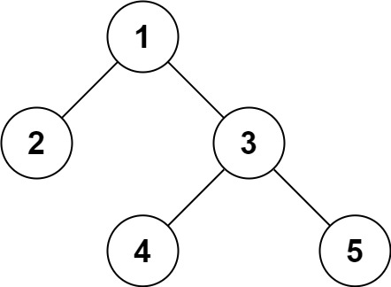

## Algorithm

[297. Serialize and Deserialize Binary Tree](https://leetcode.com/problems/serialize-and-deserialize-binary-tree/)

### Description

Serialization is the process of converting a data structure or object into a sequence of bits so that it can be stored in a file or memory buffer, or transmitted across a network connection link to be reconstructed later in the same or another computer environment.

Design an algorithm to serialize and deserialize a binary tree. There is no restriction on how your serialization/deserialization algorithm should work. You just need to ensure that a binary tree can be serialized to a string and this string can be deserialized to the original tree structure.

Clarification: The input/output format is the same as how LeetCode serializes a binary tree. You do not necessarily need to follow this format, so please be creative and come up with different approaches yourself.


Example 1:



```
Input: root = [1,2,3,null,null,4,5]
Output: [1,2,3,null,null,4,5]
```

Example 2:

```
Input: root = []
Output: []
```

Constraints:

- The number of nodes in the tree is in the range [0, 104].
- -1000 <= Node.val <= 1000

### Solution

```java
/**
 * Definition for a binary tree node.
 * public class TreeNode {
 *     int val;
 *     TreeNode left;
 *     TreeNode right;
 *     TreeNode(int x) { val = x; }
 * }
 */
public class Codec {

    public String serialize(TreeNode root) {
        return serial(new StringBuilder(), root).toString();
    }

    // Generate preorder string
    private StringBuilder serial(StringBuilder str, TreeNode root) {
        if (root == null) return str.append("#");
        str.append(root.val).append(",");
        serial(str, root.left).append(",");
        serial(str, root.right);
        return str;
    }

    public TreeNode deserialize(String data) {
        return deserial(new LinkedList<>(Arrays.asList(data.split(","))));
    }

    // Use queue to simplify position move
    private TreeNode deserial(Queue<String> q) {
        String val = q.poll();
        if ("#".equals(val)) return null;
        TreeNode root = new TreeNode(Integer.valueOf(val));
        root.left = deserial(q);
        root.right = deserial(q);
        return root;
    }
}

// Your Codec object will be instantiated and called as such:
// Codec ser = new Codec();
// Codec deser = new Codec();
// TreeNode ans = deser.deserialize(ser.serialize(root));
```

### Discuss

## Review


## Tip


## Share
